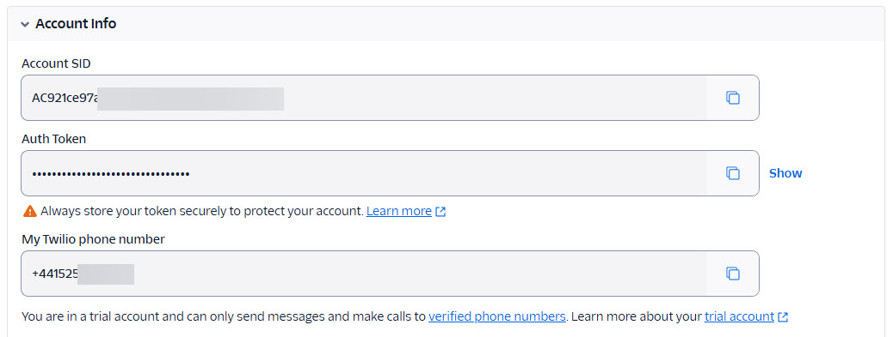
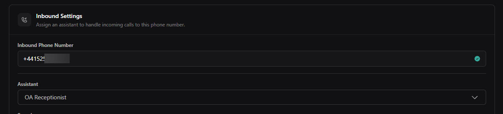
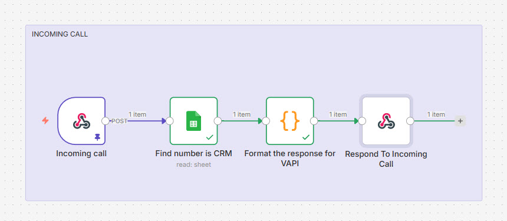

# Creating an AI Voice receptionist for ObserveAutomation

Both as an example of what can be done and as something I can sell to local businesses, I am creating an **AI Voice Receptionist** that can tell the caller about:
- Who or what is ObserveAutomation 
- What services they provide (at a high level and in some detail is needed)
- Opening hours etc.
- Anything else I put into my FAQ

It should also be able to put the call through to my mobile if the caller asks for that.

Last but not least, I should sound like me - as in the way I talk rather than the actual sound of my voice.
<!--more-->

There are a fair number of moving pieces to creating the AI Voice Receptionist.

We need a UK number - provided by Twillio.
We need a Voice AI platform: VAPI.ai
We need back-end services to deal with caller questions or requests: my self-hosted n8n

## Twilio

Initially, I am using the "free" or "trial" plan that Twilio offers.  It has some limitations such as it will only answer questions from a "verified number" (my mobile).

Also, as I am in the UK, there are some regulatory hurdles: I need to create a "regulatory bundle".  This can be done as an individual or as a company.  However as a company, Observe Automation would need to be registered at Companies House and I haven't registered it yet.  The registration is relatively cheap but once it's done other costs come in such as accounting.

Once you've created a free/trial Twilio account, go to Phone Numbers > Manage > Buy A Number.  The free/trial Twilio account lets you create one number.  You will get charged for its usage, but the trial plan comes with a little more that £10 credit.  My monthly fee is around $0.84.

You then need to create a "regulatory" bundle.  I chose the "personal" type as my company is not registered.  The 2nd step of this process is providing documentation proving who you are.  I used my passport and driving license.  The regulatory guidelines for Twillio UK numbers are [here](https://www.twilio.com/en-us/guidelines/gb/regulatory).

To be able to call your Twilio number as a "trial" user, you must register a Verified Caller.  Note that this is not required on paid plans.  However, until I go live with the AI Voice Assistant, that's enough for my needs.

To add a Verified Caller ID, head to Phone Numbers > Manage > Verified Caller ID and click on Add a new Caller ID.

For the next stage, VAPI, you will need the following information from you Twilio account:
- Account data:
  - Account SID
  - Auth Token
  - Phone Number

With all that set up, you can now start on the VAPI side of things.

## VAPI
VAPI.ai is one of the tools for voice receptionists that are "out there".  However, it does seem to have a strong following which is why I chose it.

VAPI allows you to:
- Create assistants that know how to answer calls and take instructions. 
- Create "tools" for the Assistant to use
   -  How to answer questions (by calling n8n)
   -  How to transfer a call to a person
   -  How to end a call

I am using VAPI's Pay as you go plan and I started with £10.  After a few days of testing I still have over £8 available.

### Initial set up

To start with VAPI, you need to create an Assistant which defines how you call is answered and handled.

The Assistant is where you will define they key elements and behaviours of VAPI.  At this stage (and we'll add more stuff later) you need to:
1. Give the assistant a name - "OA Receptionist" in my case.  This name is not seen outside VAPI.
2. Select the AI Provider and model - I've used OpenAI and the "GPT 4.1" which is a good balance between cost and latency.
3. Select who speaks first - as the assistant is a receptionist, I want it to speak first.
4. Provide the first message: "Hello.  This is David's AI Assistant.  How may I help you today?"
5. Provide the system prompt to control the behaviour and tone of VAPI.
6. Under "Voice Configuration", select a voice.  In my case the provider is "Vapi" and I chose the "Elliott" voice.

There is more to configure but we'll return to this later.

### Connecting the Twilio phone number to the "assistant"
While you can already test the assistant by clicking on the "Talk to assistant", for the assistant to answer calls, you must first add the number to VAPI and associate it with the agent.

To add the number from Twilio to VAPI, under Phone Numbers, click on "Create Phone Number".  In the pop-up, select Import from Twilio and provide the information (Account SID, Auth Token and Phone Number).  Don't forget to give it a friendly name.

Then, from "Phone Numbers", select the phone number and you can configure more details such as what Assistant to hand the call to.  

And also a web hook VAPI can call.  I my case, this web hook calls an n8n workflow that takes the phone number an looks it up.  If it finds it, it returns the name of the caller.

Now that that's in place, you can call the Voice receptionist from your verified phone nummber.

As a teaser, here's a video of me testing my assistants (it has, at this stage, been given instructions and access to my FAQ).


## ElevenLabs
ElevenLabs provides the text-to-speech and speech-to-text functionality for VAPI.  The costs of Eleven Labs is included in the costs for VAPI