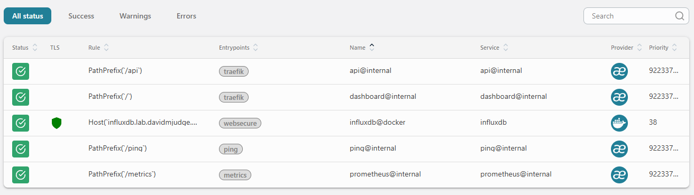
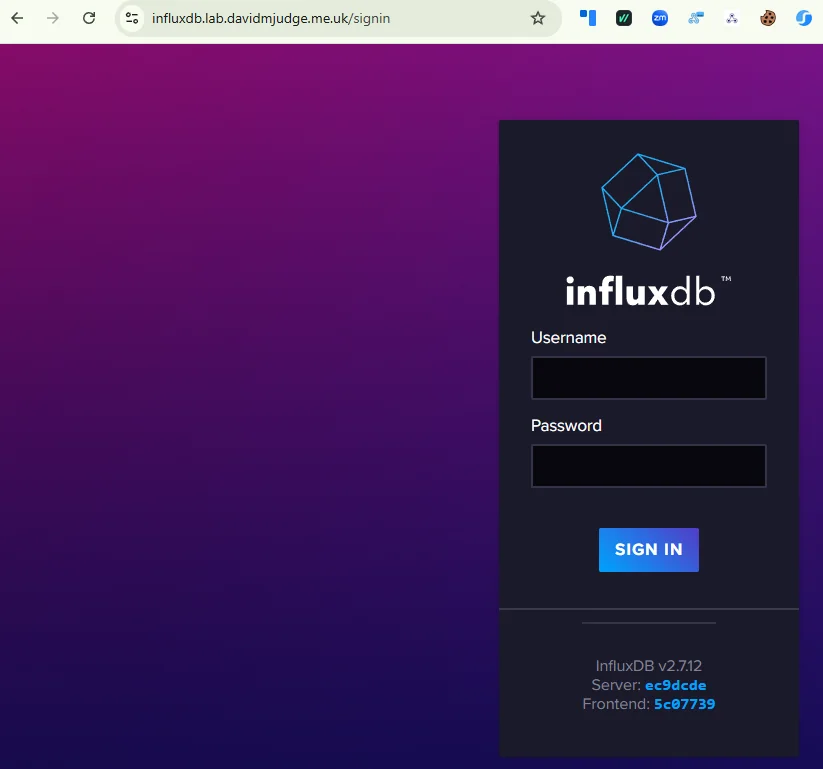
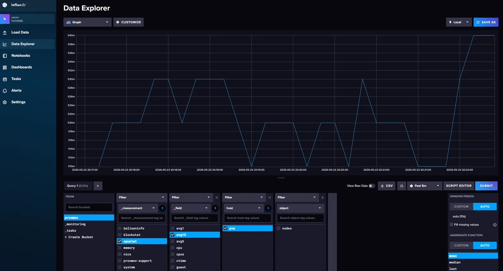

services:
  influxdb:
    image: influxdb:2.7
    container_name: influxdb
    hostname: influxdb.lab.davidmjudge.me.uk
    restart: unless-stopped
    environment:
      - TZ=Europe/London
      - DOCKER_INFLUXDB_INIT_MODE=setup
      - DOCKER_INFLUXDB_INIT_USERNAME=${INFLUXDB_ADMIN_USER}
      - DOCKER_INFLUXDB_INIT_PASSWORD=${INFLUXDB_ADMIN_PASSWORD}
      - DOCKER_INFLUXDB_INIT_ORG=${INFLUXDB_ORG}
      - DOCKER_INFLUXDB_INIT_BUCKET=${INFLUXDB_BUCKET_PROXMOX}
      - DOCKER_INFLUXDB_INIT_RETENTION=${INFLUXDB_RETENTION}
      - DOCKER_INFLUXDB_INIT_ADMIN_TOKEN=${INFLUXDB_ADMIN_TOKEN}
    volumes:
      - ./data/influxdb:/var/lib/influxdb2
      - ./data/influxdb-config:/etc/influxdb2
    labels:
      - "traefik.enable=true"
      - "traefik.http.routers.influxdb.rule=Host(`influxdb.lab.davidmjudge.me.uk`)"
      - "traefik.http.routers.influxdb.entrypoints=websecure"
      - "traefik.http.routers.influxdb.tls=true"
      - "traefik.http.routers.influxdb.tls.certresolver=cloudflare"
      - "traefik.http.routers.influxdb.middlewares=secure-headers@file"
      - "traefik.http.services.influxdb.loadbalancer.server.port=8086"
    networks:
      - proxy
      - monitoring

networks:
  proxy:
    external: true
  monitoring:
    external: true
```

Worth calling out:

- **`DOCKER_INFLUXDB_INIT_*` env vars** drive InfluxDB's one-shot bootstrap on first run. They create the admin user, organisation, bucket, retention policy, and admin token. After the first successful start they're no-ops; the state lives in `./data/influxdb-config/`.
- **Pre-set admin token** (`DOCKER_INFLUXDB_INIT_ADMIN_TOKEN`): a random secret you generate yourself and put in `.env` *before* the first `docker compose up -d`. InfluxDB reads it during the one-shot bootstrap, creates the admin user with that exact string as the admin's API token, and then ignores the env var on every subsequent boot (the value lives in `./data/influxdb-config/` from then on). Setting it up front avoids having to log into the UI to fetch a token before anything else can be configured. It's still the admin token, so treat it as such — `openssl rand -hex 32` is the standard way to produce one (64 hex chars, 256 bits of entropy).
- **No `ports:` published.** InfluxDB listens on port 8086 inside the container; Traefik routes to it from `https://influxdb.lab.davidmjudge.me.uk`. Both the UI and the write API live behind the same hostname.
- **Both networks.** `proxy` for Traefik ingress, `monitoring` so Grafana can reach InfluxDB over the internal backplane as `influxdb:8086` once it arrives in step 3.

## `.env`

```
# InfluxDB v2 — used only on first run; afterwards state lives in ./data/influxdb-config/
INFLUXDB_ADMIN_USER=admin
INFLUXDB_ADMIN_PASSWORD=
# Generate with: openssl rand -hex 32
INFLUXDB_ADMIN_TOKEN=

# Org and bucket
INFLUXDB_ORG=homelab
INFLUXDB_BUCKET_PROXMOX=proxmox

# Retention for the proxmox bucket. 30d is a starting point; extend later if disk allows.
INFLUXDB_RETENTION=30d
```

A note on retention. Proxmox sends a healthy chunk of data: host CPU, memory, and disk, plus per-VM stats, every 10 seconds. 30 days is enough to debug recent issues and gives Grafana useful week-over-week comparison. Extending to 90 days is the obvious next step once disk usage tells you what's affordable.

## Bringing it up

CNAME first, so the cert challenge will resolve. On the `dns` host, in the zone file:

```
influxdb   IN  CNAME  monitor.lab.davidmjudge.me.uk.
```

Then from the workstation:

```bash
ssh monitor 'mkdir -p ~/influxdb'
rsync -av --exclude='.env' --exclude='data/' stack/01-influxdb/ monitor:~/influxdb/
```

On monitor:

```bash
cd ~/influxdb
cp .env.example .env

# Generate the admin token (any cryptographically random string)
openssl rand -hex 32
# Paste the output into INFLUXDB_ADMIN_TOKEN in .env, then set INFLUXDB_ADMIN_PASSWORD too
$EDITOR .env

# Pre-create the bind-mount directories. If Docker creates them, they'll be
# owned by root and InfluxDB (running as UID 1000 in the container) won't be
# able to write to them on first boot.
mkdir -p data/influxdb data/influxdb-config

docker compose up -d
docker compose logs -f influxdb        # watch for "Listening" and the cert grant
```

On a standard Ubuntu user account this works out of the box: your shell user is UID 1000, `mkdir` makes the dirs with that ownership, and the container's UID 1000 matches. If your user is something else, add `sudo chown -R 1000:1000 data/` after the `mkdir` to match the container's expectation.

Traefik will issue a Let's Encrypt cert for `influxdb.lab.davidmjudge.me.uk` via the Cloudflare DNS challenge automatically. The first request to the URL might take a few seconds while it lands.

A quick sanity check in the Traefik dashboard at `http://traefik-monitor.lab.davidmjudge.me.uk:8080/dashboard/`. The new `influxdb@docker` router should appear green, with TLS active (the shield icon) and bound to the `websecure` entrypoint:



Then open `https://influxdb.lab.davidmjudge.me.uk` and sign in with the admin user and password from `.env`. The browser treats the connection as secure with no warnings: the Cloudflare DNS challenge produced a real Let's Encrypt cert.



## A scoped token for Proxmox

Don't use the admin token to write metrics from Proxmox. If the token leaks, the blast radius is the whole InfluxDB instance. Create a token scoped to write-only on the `proxmox` bucket.

In the InfluxDB UI:

1. **Load Data** → **API Tokens** → **Generate API Token** → **Custom API Token**
2. **Description:** `proxmox-write`
3. **Bucket permissions:** `proxmox` → tick **Write** only (leave Read unticked)
4. **Generate**, copy the token immediately. It's only shown once.

(The token is implicitly scoped to whichever organisation you're signed into, which is `homelab` if you used the value from `.env`. The dialogue doesn't ask for an org.)

Save it somewhere safe; Proxmox needs it in the next step.

## Pointing Proxmox at InfluxDB

In the Proxmox web UI:

1. **Datacenter** → **Metric Server** → **Add** → **InfluxDB**
2. **Name:** `homelab-influxdb` (or anything descriptive)
3. **Server:** `influxdb.lab.davidmjudge.me.uk`
4. **Port:** `443`
5. **Protocol:** `https`
6. **Organization:** `homelab`
7. **Bucket:** `proxmox`
8. **Token:** the `proxmox-write` token from the previous step
9. **API path prefix:** leave blank (defaults to `/api/v2/write`)
10. **Verify Certificate:** ticked (we have a real Let's Encrypt cert via Cloudflare)
11. **Interval:** 10 seconds (Proxmox's default; fine to leave)
12. **Enabled:** ticked

Save. Proxmox starts pushing immediately.

## Verifying

Back in the InfluxDB UI: **Data Explorer** → select the `proxmox` bucket. After a minute or two, the measurement list populates with the Proxmox schema:

- `system` — host CPU, load average, uptime
- `cpustat` — per-CPU metrics
- `memory` — host memory
- `blockstat` — per-VM disk I/O
- `nics` — network interface counters
- `proxmox-support` — pveproxy / pvestatd internal metrics

Build a quick query to confirm the flow. Under `_measurement` tick `cpustat`, under `_field` tick `avg15` (the 15-minute load average), under `host` tick your Proxmox node (mine is `pve`), then **Submit**. A line on the chart confirms the path end-to-end: Proxmox → Traefik → InfluxDB → query, with a fresh point every 10 seconds.



If nothing arrives, check three things in order:

1. The Proxmox web UI for an error against the metric server (red bell icon, top right)
2. `pvestatd` logs on the Proxmox host (`journalctl -u pvestatd -f`)
3. Traefik's access log for the `POST /api/v2/write` requests (`docker compose logs traefik -f` in `~/traefik`)

## What's next

Grafana, on top of InfluxDB. Same compose pattern, same networks, same Traefik labels. Once it's up, the `proxmox` bucket becomes a Grafana datasource and the first dashboards land.
