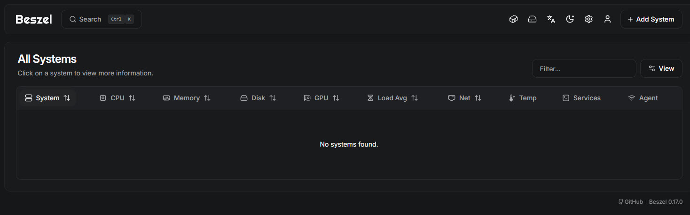
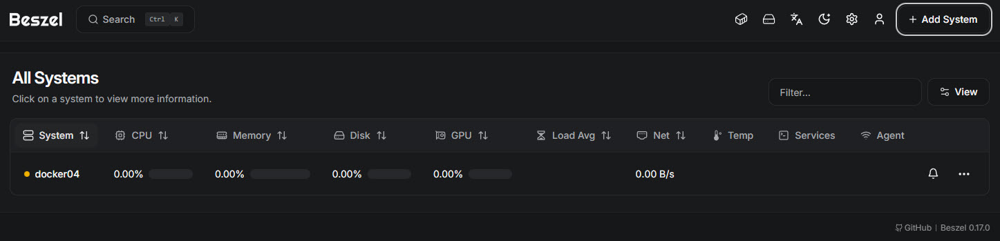
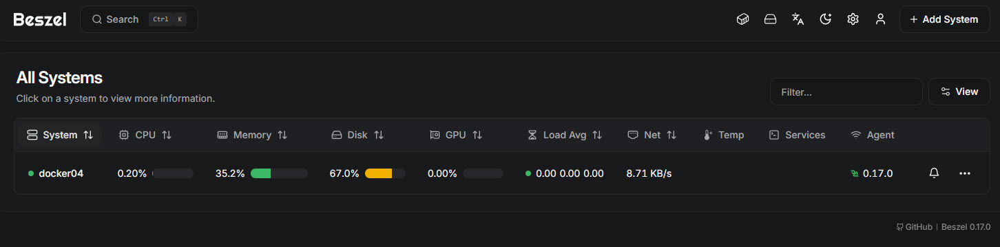

 

# It's time to get som insights into my home lab

My home lab is getting messy and I don't have a full understanding of what's running where... on which of my 5 machines and 3 docker "hosts".

It's time to get some clarity and insights with Beszel

<!--more-->

For my set-up, we will run one "central" instance of Beszel (in Docker) and, where needed, run Beszel Agents which will collect data and send it back to the central (and only) Beszel.

> [!note] Key Information
> This callout has a custom title to emphasize its importance.

Spinning up the central Beszel container is straightforward.

On the docker machine or VM:
* Create a beszel directory to hold you container files
* Create a data directory called beszel_data (as per Beszel install. documentation)
* Create the compose.yml as below
* Start the container with docker compose up (no "-d" at this stage)

``` yaml
services:
  beszel:
    image: henrygd/beszel:latest
    container_name: beszel
    restart: unless-stopped
    ports:
      - 8090:8090
    volumes:
      - ./beszel_data:/beszel_data
```

## Starting the container

The first time we start the container, we don't use the -d flag so that we can see the output:

``` bash
david@docker04:~/beszel$ docker compose up 
[+] up 2/2
 ✔ Network beszel_default Created                                                             0.0s 
 ✔ Container beszel       Created                                                             0.1s 
Attaching to beszel
beszel  | 2025/12/29 09:47:51 Server started at http://0.0.0.0:8090
beszel  | ├─ REST API:  http://0.0.0.0:8090/api/
beszel  | └─ Dashboard: http://0.0.0.0:8090/_/
```

The output shows how to connect to the Beszel dashboard as http://0.0.0.0:8090/_/ which means it's listening for requests coming on all IP addresses.  

At this point you can also disconnect from the container's output by pressing "d".

To access the dashboard, point your browser to http://<your_IP>:8090


In your browser you are prompted to create the Beszel administrator account:


After which you are taken to the dashboard:



As you can see, it's empty and we need to add systems to monitor.

Let's start with monitoring "docker04 which is the VM (ono Proxmox) that's running the central Beszel.

To keep things simple at this stage, I'm going to configure the agent in it's own compose file though I will merge the 2 services into a single compose file for this server.

Clocking on "+ Add Server" (top right of the dashboard), we get a pop up and can provide information on what we're adding.  In this case, I'm going select "docker", name the "system" "docker04" and provide the fqdn for the server.  Beszel will populate the other fields: port, public key and the token.


Once this is all entered, clicking on "Copy docker compose" which lets me copy the compose file.  Below you can see the docker compose file being created along with the data directory.

``` bash
david@docker04:~$ mkdir beszel_agent
david@docker04:~$ cd beszel_agent
david@docker04:~/beszel_agent$ cat >> compose.yml
services:
  beszel-agent:
    image: henrygd/beszel-agent
    container_name: beszel-agent
    restart: unless-stopped
    network_mode: host
    volumes:
      - /var/run/docker.sock:/var/run/docker.sock:ro
      - ./beszel_agent_data:/var/lib/beszel-agent
      # monitor other disks / partitions by mounting a folder in /extra-filesystems
      # - /mnt/disk/.beszel:/extra-filesystems/sda1:ro
    environment:
      LISTEN: 45876
      KEY: 'ssh-ed25519 AAAAC3NzaC1lZDI1NTE5AAAAIA/GX+4bCPpAhza04qE1ctkwgLIznvZE7RxZLsbslZ08'
      TOKEN: 398d6-7b55acb68-6d785-95a2462a
      HUB_URL: http://192.168.178.54:8090
david@docker04:~/beszel_agent$ mkdir beszel_agent_data
```

Last but not least, I click on the "Add system" to add the entry to the dashboard (note that the data won't start coming in until the agent is started.)

> **Warning:**
> You must click on "Add system" for the  Beszel dashbaord to receive data from the agent!




As I start the agent, we can see the logs showing it's connecting to the Beszel server:
``` bash
david@docker04:~/beszel_agent$ docker compose up
[+] up 4/4
 ✔ Image henrygd/beszel-agent Pulled                                                          2.0s 
 ✔ Container beszel-agent Created                                                             0.1s 
Attaching to beszel-agent
beszel-agent  | 2025/12/29 10:18:40 INFO Data directory path=/var/lib/beszel-agent
beszel-agent  | 2025/12/29 10:18:40 INFO Detected root device name=sda1
beszel-agent  | 2025/12/29 10:18:40 INFO Detected network interface name=eth0 sent=382875279 recv=772136112
beszel-agent  | 2025/12/29 10:18:40 INFO WebSocket connected host=192.168.178.54:8090

w Enable Watch   d Detach
```

Shortly after we start to see data coming into Beszel:

