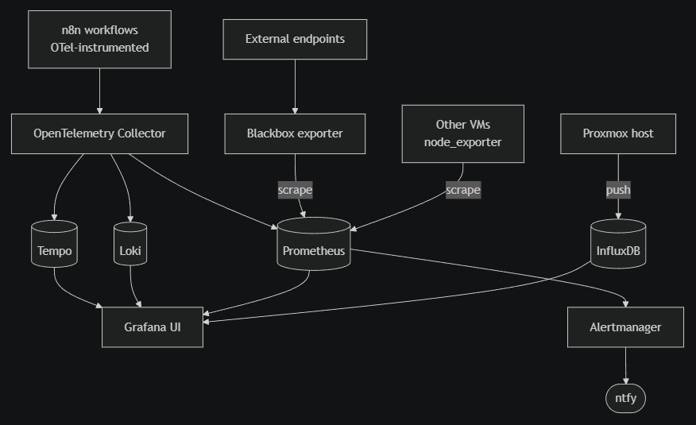

I've been working in observability long enough to have strong opinions about what a properly designed platform looks like. The homelab should be where I get to run those opinions end to end without compromise. Until recently it has been monitored by a sensible-but-tactical mix: Beszel for container health, a handful of cron checks, the Proxmox dashboard when I remember to open it. That does what tactical monitoring is meant to do, but it falls well short of what I want the monitoring stack of my own infrastructure to look like.

So I'm starting again, properly this time, on a fresh Ubuntu VM I'm calling monitor. I'll install one component at a time, each landing as its own post. 

<!--more-->

## What "properly" looks like

Right now, the end state is a Grafana stack on a single VM, with OpenTelemetry Collector as the unifying ingest layer for new instrumentation, Prometheus for pull-based scraping, InfluxDB for the Proxmox metrics that the hypervisor pushes natively, Loki for logs, and Tempo for traces. Alerting routes through Alertmanager into ntfy.

### Initial suggestion of the monitoring stack

Traefik handles ingress for the whole stack. Every UI exposed by the monitor VM is configured via Traefik labels on its container, with a CNAME in the Bind zone pointing at `monitor.lab.davidmjudge.me.uk`. No container publishes a port directly to the host. The next post stands the monitor VM up and gets Traefik running before any of the observability components arrive.

It is more than a homelab strictly needs. That is the point. The goal is not minimum viable monitoring; it is a properly designed observability platform, scaled down. Every component has to earn its place in the architecture, and every choice is the same one I would make at a larger scale.

## Why step by step

This is a deliberate sequencing choice. Observability platforms rarely arrive end-to-end in one go; they grow in response to need, and the order in which components arrive shapes the design. I'm building it the way I would build it for a small team: tactical first, then refactor toward strategic once the load justifies the complexity.

The path of least resistance for capturing Proxmox metrics is InfluxDB, because Proxmox writes there natively, no glue required. So that is step one. Grafana goes on top to actually see the data. Prometheus joins when the rest of the lab needs scraping. Loki for logs. OpenTelemetry Collector becomes worthwhile once enough sources exist to justify a unifying layer. And so on.

One component per post, with the decision record and the configuration as it lands in production. If everything arrived at once the write-up would be eight thousand words and useless to anyone reasoning about their own setup, future-me very much included.

## The series

The plan, in order:

1. **This post**: the design intent
2. Setting up the monitor VM and Traefik
3. InfluxDB to capture Proxmox metrics
4. Grafana for the first dashboards
5. Prometheus and node_exporter for the rest of the lab
6. Loki and Promtail for centralised logs
7. OpenTelemetry Collector as a unified pipeline
8. n8n workflow instrumentation
9. Tempo for distributed tracing
10. Blackbox and Alertmanager for synthetic checks and alerts
11. A final portfolio piece that ties it together

Some of those will land in the order shown. Some won't. Some will get split if a single post starts getting too dense. The repo will always be the source of truth for the actual config.

## What I'm deliberately not building

- **No Kubernetes.** Docker Compose is enough at homelab scale and keeps every post readable in a single file. The skills transfer.
- **No multi-tenancy or RBAC.** One admin, one dashboard. Adding access control is a different project.
- **No long-term retention strategy.** When InfluxDB or Prometheus start hurting on disk, I'll add Mimir or migrate. Future post.

Each of these is a scope decision, not an oversight. Discipline about what to leave out matters as much as discipline about what to include.

## Following along

The whole project lives in a private repo for now; anything useful surfaces in these posts, including the trade-offs and the bits I changed my mind about. If you are working on something similar and would have made a different choice, the discussion is welcome.

Next up: getting Proxmox metrics flowing into InfluxDB.
