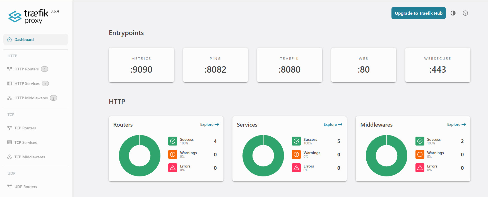

# Adding redundancy to my Docker environment
I currently run 2 docker VMs but they are running on the same Proxmox instance.  However, should that PVE instance go down, I would have nowhere to run any of the containers, so my way of dealing with this is in 2 steps:
* Build a new Proxmox VE server
* Create a new VM to host my containers

<!--more-->

I built the Proxmox VE server over the past weekend.  You can read about that here: [Proxmox Server 2](../New-Proxmox-Server/index.md)

To build the VM, I will use a script to run on the PVE server which leverages CloudInit.

I will break down the script here and will include the whole script at the end of this article.

There are 3 main parts to the script:
* Retrieving the CloudInit image
* Setting the "basic" VM configuration (i.e. CPU, RAM, etc.)
* Setting the CloudInit parameters for the VM (networking, User, etc.)

I have tried to ensure that most values are parameterised, though some, like the server which holds the CloudInit images are hard-coded to my preferred source: Ubuntu.

I hope the code and comments are self-explanatory - If you find them not to me, please send me a message (links in the Contact Me Page).


## Retrieving the CloudInit Image
The first step is to retrieve the CloudInit image that will be used to create the VM.

Here we'll be using Ubuntu's "Noble" release.

```bash
CI_IMAGE_NAME="noble-server-cloudimg-amd64.img"
CI_IMAGE_LOCATION="/var/lib/vz/template/iso/"
if [ -f ${CI_IMAGE_LOCATION}${CI_IMAGE_NAME} ]; then
    echo "Cloud image already downloaded."
else
    echo "Downloading cloud image..."
    cd ${CI_IMAGE_LOCATION}
    wget https://cloud-images.ubuntu.com/noble/current/${CI_IMAGE_NAME}
    cd -
    echo "Download of cloud image complete."
fi
```

You will notice that there's little error checking here at this time.

## Creating the "basic" VM
The next step is to create the VM within Proxmox, to allocate the resources, including the CloudInit image.

You will see that at the top of this section, there are a number of variables that can be modified, like the number you want to give the template, The last octet of the IP address, etc.

```bash
TEMPLATE_NUM=8000
VM_NAME="dock03"
VM_NUM=200
VM_IP="55"
VM_MEMORY="4096"
VM_CORES="3"
VM_STORE="local-lvm"
# Change the commented-out lines per your choice
VM_FULL_CLONE="true"
# VM_FULL_CLONE="false"
# NB: Use of this flag is NOT YET IMPLEMENTED
# VM_FULL_CLONE="false" will create a linked clone, which is not recommended for production use.
# ANote that specifying the storage is not allowed for a linked clone
cd /var/lib/vz/template/iso
# Create the VM and attach the CloudInit image
# Note that the disk import takes time!
qm create ${TEMPLATE_NUM} --memory ${VM_MEMORY} --core ${VM_CORES} --name ubuntu-cloud --net0 virtio,bridge=vmbr0
qm disk import ${TEMPLATE_NUM} noble-server-cloudimg-amd64.img ${VM_STORE}
cd -
# The disk import (above) will take the IMG file and create a disk in the appropriate 
# location on the Proxmox server as disk-0
#
# The disk is attached to the VM's definition and resized, growing it by 100Gb
qm set ${TEMPLATE_NUM} --scsihw virtio-scsi-pci --scsi0 ${VM_STORE}:vm-${TEMPLATE_NUM}-disk-0
qm resize ${TEMPLATE_NUM} scsi0 +100G
# Add the cloudinit drive which will store the configuration for CloudInit to 
# read when the VM is started.  The drive is attached to "ide2"
qm set ${TEMPLATE_NUM} --ide2 ${VM_STORE}:cloudinit
# Miscellaneous parameters:
qm set ${TEMPLATE_NUM} --boot order=scsi0
qm set ${TEMPLATE_NUM} --agent enabled=1
qm set ${TEMPLATE_NUM} --serial0 socket --vga serial0
# We then convert the VM to a template
qm template ${TEMPLATE_NUM}
```

## Setting the CloudInit parameters
We now have a fully-functional VM and could start it if we wished (though, technically, you'd have to clone it to start it - a template can't be started).

This last part of the script sets the parameters for CloudInit which the CloudInit service will read and act upon at every start-up of the VM.

The last step is to start the VM which will, thanks to CloudInit, configure the VM

```bash
# Create a file with all the public ssh keys - I've included keys from my PC and from my "Ansible server"
cat > ~/.ssh/all.pub <<EOF
ssh-ed25519 AAAAC3NzaC1lZDI1NTE5AAAAIKL1EWv5ZwWTti7qoZbA+OZDGE5U+JhUU1Mxb+M0ZxkL ansibleuser@ansible4
ssh-ed25519 AAAAC3NzaC1lZDI1NTE5AAAAIAP9eyxA4P8mE51qmbnigiuEmX72dRFRuN4SLmp0ISuA david@Ryzen2
EOF

qm set ${TEMPLATE_NUM} --ipconfig0 ip=192.168.178.${VM_IP}/24,gw=192.168.178.1
qm set ${TEMPLATE_NUM} --cpu cputype=host 
qm set ${TEMPLATE_NUM} --ciuser "david"
# See https://docs.openssl.org/1.0.2/man1/passwd/ for how to generate a password hash
# Example... qm set ${TEMPLATE_NUM} --cipassword $(openssl passwd $CLOUD_INIT_USER_PASSWORD)
# or set a non-encrypted string.
# Note that it is not recommended to set the cloudinit password - users should log in via ssh leveraging keys
qm set ${TEMPLATE_NUM} --cipassword "chestnut1999"

qm set ${TEMPLATE_NUM} --sshkeys ~/.ssh/all.pub
qm set ${TEMPLATE_NUM} --nameserver="192.168.178.5 8.8.8.8"
qm set ${TEMPLATE_NUM} --searchdomain="lab.davidmjudge.me.uk"

qm cloudinit update ${TEMPLATE_NUM}

# To control where the full clone will place its disk, add '--storage data4tb' to the command below.
qm clone ${TEMPLATE_NUM} ${VM_NUM} --name ${VM_NAME} --full true 

qm start ${VM_NUM}
```

## Installing Docker and other tools
With the VM up and running, we now need to install the various tools that we want/need:
* Docker
* Docker Compose
* vim
* net-tools
* htop
* qemu-guest-agent

I have a preference for installing software from official APT repositories where possible, so I am following the instructions [from Docker's documentation site](https://docs.docker.com/engine/install/ubuntu/).

Docker does have an official APT repository, but it must be installed and then an `apt update` must be run.

However, before diving into that, let's remove the need for our user to have to provide a password for sudo commands.  The recommended approach for this is a manual edit using the `sudo visudo` command.
Once in the editor we will add a line like this (for my user 'david'):
`david ALL=(ALL) NOPASSWD: ALL`

Once saved, I like to exit my session and log in again to check it's working.

### Docker's APT repo

First we need to add Docker's GPG key:

```bash
# Add Docker's official GPG key:
sudo apt update
sudo apt install ca-certificates curl
sudo install -m 0755 -d /etc/apt/keyrings
sudo curl -fsSL https://download.docker.com/linux/ubuntu/gpg -o /etc/apt/keyrings/docker.asc
sudo chmod a+r /etc/apt/keyrings/docker.asc
```

Then we add the APT repository to the list and run apt update:
```bash
# Add the repository to Apt sources:
sudo tee /etc/apt/sources.list.d/docker.sources <<EOF
Types: deb
URIs: https://download.docker.com/linux/ubuntu
Suites: $(. /etc/os-release && echo "${UBUNTU_CODENAME:-$VERSION_CODENAME}")
Components: stable
Signed-By: /etc/apt/keyrings/docker.asc
EOF

sudo apt update
```

Now we're ready to actually install docker and the required piece for Docker.

```bash
sudo apt install -y docker-ce docker-ce-cli containerd.io docker-buildx-plugin docker-compose-plugin
```

And the extra tools that I like:
```bash
sudo apt install -y vim htop net-tools qemu-guest-agent
```

The qemu guest agent (which lets me see things like the IP address from the PVE GUI) works best if the VM is shut down and then started (I'm told that a plain restart is not good enough and that it's not the same).  One needs to pause between the shutdown and start commands to let the shutdown to complete.

On the proxmox server, the commands below will do the trick - here using 200 as the VM ID as that's what the earlier scripting created:
```bash
qm shutdown 200
sleep 120
qm start 200
```

### Last but not least: Access to Docker
To enable a normal user (i.e. a non-privileged user) to use Docker, they must be added to the Docker group on the server:
```bash
sudo usermod -aG docker $USER
```

You will need to log out and log back in for that to take effect.  For efficiency, you may want to run this command before the shutdown/start of the VM.

Just to be able to show that our docker VM is up and running I deployed Traefik... Here's the dashboard:

