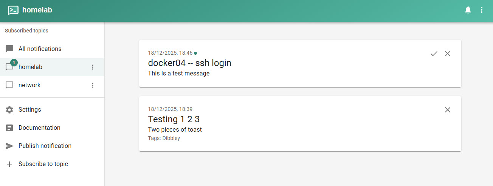
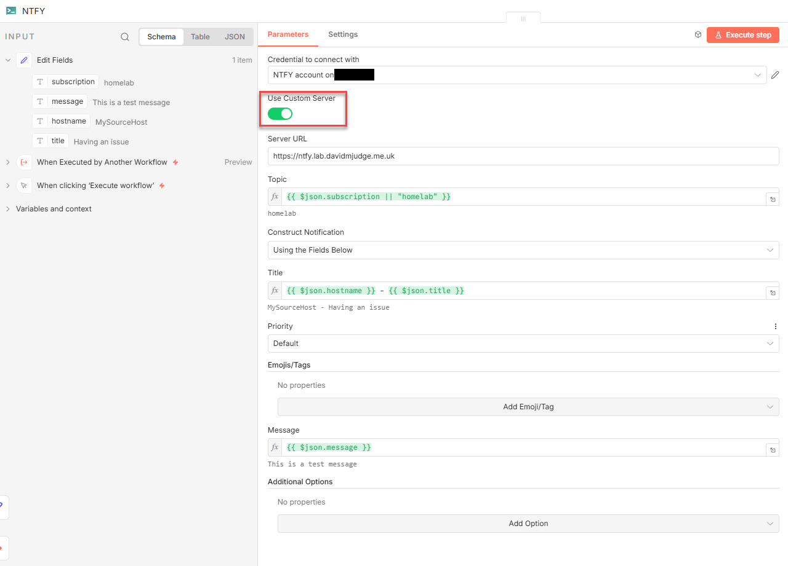

As part of my wider monitoring of my home lab, I want active notifications that I can receive while at home even when my broadband is down - in fact, mainly when my broadband is down.

Most of my methods of notification (Email, slack, etc.) require an internet connection. But I’ve been having minor outages due to either my ISP or my new router and I want to be notified of these while the outage is on-going (i.e. when the internet is not accessible). 

<!--more-->

Ntfy.sh is easy to deploy as a container, which is the approach I’ve taken (compose file lower in this article). It will sit behind traefik which acts as a reverse proxy and to provide the SSL certificates.

As always, the first step after deciding where the container is run is to update my DNS with a CNAME record:

``` dns
ntfy		IN	CNAME	docker04.lab.davidmjudge.me.uk.
```

After a quick docker compose restart of our dns container, the new name is resolvable.

``` bash
$ nslookup ntfy.lab.davidmjudge.me.uk
Server:  UnKnown
Address:  192.168.178.5

Name:    docker04.lab.davidmjudge.me.uk
Address:  192.168.178.54
Aliases:  ntfy.lab.davidmjudge.me.uk
```

> **Warning**
> Do not let the ntfy container create the directories as they will be owned by root which causes problems

I initially spun up an instance of ntfy.sh using the docker compose section from the [ntfy.sh documentation](https://docs.ntfy.sh/install/#docker). I could connect to the web UI directly using its IP address and port, but had a message telling me that the messaging API required an SSL-encrypted connection. And, as there were no traefik labels in the compose file, the container wasn’t detected and wasn’t being proxied.

A quick update of the ntfy compose.yml with some traefik labels fixed this and we now have a cert for ntfy.

While the ntfy container is not exposed to the internet (where it could be open to abuse), I want to secure it.  So I need to create a user with sufficient privileges to send, etc. notifications.

## Create a user with admin role
``` bash
david@docker04:~/ntfy/etc/ntfy$ docker exec -it ntfy /bin/sh
~ $ ntfy user add --role=admin david
user david added with role admin
~ $ ntfy user list
user david (role: admin, tier: none)
- read-write access to all topics (admin role)
user * (role: anonymous, tier: none)
- no topic-specific permissions
- no access to any (other) topics (server config)
~ $ exit
```


## Creating a token
Tokens are generally considered safer then authentication requests using a user:password pair.

Note that as this web site is built on a base that’s in GitHub, there are some github rules I need to comply with - one is not to store tokens. So I have obfuscated the token in the next two commands or their output.

``` bash
david@docker04:~/ntfy/etc/ntfy$ docker exec -it ntfy /bin/sh
~ $ ntfy token add david
token tk_XXXXXXXXXXXXXXXXXXXXXXXXXXXXX created for user david, never expires
~ $ exit
david@docker04:~/ntfy/etc/ntfy$ 
```


## Sending a message to ‘homelab’
Time to test sending a notification:

``` bash 
david@docker04:~/ntfy/etc/ntfy$ curl -H "Title: ${HOSTNAME} -- ssh login" \
  -u :tk_XXXXXXXXXXXXXXXXXXXXXXXXXXXXX \
  https://ntfy.lab.davidmjudge.me.uk/homelab \
  -d "This is a test message"
{"id":"QwMDCMvJjlqN","time":1766083567,"expires":1766126767,"event":"message","topic":"homelab","title":"docker04 -- ssh login","message":"This is a test message"}
david@docker04:~/ntfy/etc/ntfy$ 
```
Message appearing in the ntfy Web UI:


## ntfy from n8n
The main use case for ntfy in my environment is sending notifications from n8n workflows for both within workflows and also for notification of errors in workflows.

Ntfy.sh does not have an integration of out the box.  However there are a few community nodes.  I have chosen to use `@jyln/n8n-nodes-ntfy`.  [Here is a link to the documentation.](@jyln/n8n-nodes-ntfy)

This caught me out initially: On the whole, ntfy assumes that you will be using their cloud instance.  For the ntfy node to talk to my self-hosted server, I had to enable "custom server" and provide the full URL of my server `https://ntfy.lab.davidmjudge.me.uk`.



The ntfy node also accepts JSON which allows for far richer notifications (e.g. levels like 'warn', 'critical', etc. and many more parameters).

Here is my final compose file:
``` yaml
services:
  ntfy:
    image: binwiederhier/ntfy
    container_name: ntfy
    command:
      - serve
    environment:
      - TZ=Europe/London    # optional: set desired timezone
    user: 1000:1000 # optional: replace with your own user/group or uid/gid
    volumes:
      - ./cache/ntfy:/var/cache/ntfy
      - ./etc/ntfy:/etc/ntfy
    ports:
      - 8010:80 # to be able to access directly without reverse proxy
    healthcheck: # optional: remember to adapt the host:port to your environment
        test: ["CMD-SHELL", "wget -q --tries=1 http://localhost:80/v1/health -O - | grep -Eo '\"healthy\"\\s*:\\s*true' || exit 1"]
        interval: 60s
        timeout: 10s
        retries: 3
        start_period: 40s
    restart: unless-stopped
    networks:
      - proxy
    init: true # needed, if healthcheck is used. Prevents zombie processes
    labels:
      - "traefik.enable=true"
      - "traefik.http.routers.ntfy.entrypoints=web"
      - "traefik.http.routers.ntfy.rule=Host(`ntfy.lab.davidmjudge.me.uk`)"
      # This middleware redirects http to https
      - "traefik.http.middlewares.ntfy-https-redirect.redirectscheme.scheme=https"
      - "traefik.http.routers.ntfy-secure.entrypoints=websecure"
      - "traefik.http.routers.ntfy-secure.rule=Host(`ntfy.lab.davidmjudge.me.uk`)"
      - "traefik.http.routers.ntfy-secure.tls=true"
      - "traefik.http.routers.ntfy-secure.service=ntfy"
      # Set the resolver so Traefik knows where to requesrt the cert from
      - "traefik.http.routers.ntfy-secure.tls.certresolver=cloudflare"
      - "traefik.http.services.ntfy.loadbalancer.server.port=80"
      - "traefik.docker.network=proxy"

networks:
  proxy:
    name: proxy  # This is the network on which traefik sits
    external: true

```


The documentation site for ntfy.sh is: https://docs.ntfy.sh/