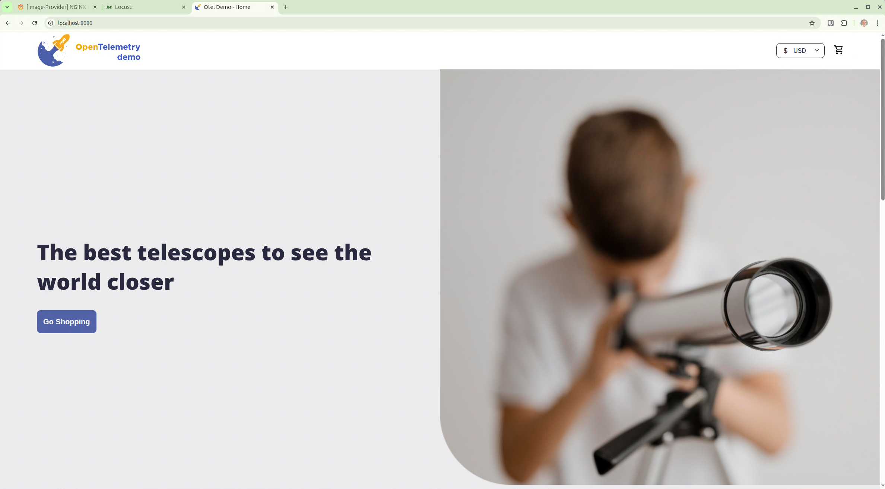

# The latest in monitoring and telemetry
For some time I've been thinking I should write a bit more about monitoring my home lab and practice OpenTelemetry ("OTel").

Initially, I want to deploy the OpenTelemetry demo and understand how it works, what data it reports, etc.

Once that's up and running I want to instrument other services and applications.  At the very least pull all the logs from my Docker containers (on 3 VMs) into one place.  While I already have [Dozzle](https://dozzle.dev/) running, being able to correlate (at least visually) the logs with event and metrics is something I want to have as it would take me one step closer to Observability.

Out of the box, the OpenTelemetry Demo needs a browser running locally, so I'm installing on my "GUI Dev Box" VM which, as the name suggests, has a GUI that I can connect to via MS Remote Desktop (even though it's a Ubuntu VM).

<!--more-->

OpenTelemetry have some great documentation.  [This page](https://opentelemetry.io/docs/demo/docker-deployment/) has installation instructions to get the demo up and running in one Docker-Compose file.

The first step is to clone the OTel Demo repository:
```bash
git clone https://github.com/open-telemetry/opentelemetry-demo.git
```

Change into the directory that was created then start it all up with docker compose:

```bash
docker compose up --force-recreate --remove-orphans --detach
```

Docker PS showed that the container called "llm" was restarting repeatedly.

According to the Copilot chatbot, it's a known issue with the OTel demo.  The max memory of "llm" needs to be doubled.

This time, all the containers have started:
```
david@guidevbox:~$ docker ps --format "table {{.ID}}\t{{.Names}}\t{{.Status}}"
CONTAINER ID   NAMES             STATUS
a1ed556bd7b0   frontend-proxy    Up 19 minutes
07674ea8e423   load-generator    Up 19 minutes
b9bcdd68dfeb   frontend          Up 19 minutes
0f6c8019f22c   checkout          Up 16 minutes
3ea16b85f898   product-reviews   Up 19 minutes
1223d0c40275   recommendation    Up 19 minutes
85c708f05adf   fraud-detection   Up 19 minutes
9771fa11aed7   payment           Up 19 minutes
2f49c15dacc0   shipping          Up 19 minutes
030b6298cc77   quote             Up 19 minutes
668950de2922   image-provider    Up 19 minutes
c26d1774e23c   product-catalog   Up 19 minutes
e5a9c689a057   email             Up 19 minutes
e6d261dc47f3   accounting        Up 19 minutes
bf536ac7f413   ad                Up 19 minutes
1f3b2d547e25   flagd-ui          Up 19 minutes
c87f30430c4f   cart              Up 19 minutes
ed2aaded8859   currency          Up 19 minutes
a435f40710b8   llm               Up 19 minutes
9b0035caa90e   otel-collector    Up 19 minutes
b6fddbbbbeec   postgresql        Up 19 minutes
566a8b1a9dee   flagd             Up 19 minutes
890d5976d1f2   prometheus        Up 19 minutes
d1fdbc888f96   jaeger            Up 19 minutes
281e68ad2093   kafka             Up 19 minutes (healthy)
9a8586dd851c   opensearch        Up 19 minutes (healthy)
4507dd40dc41   grafana           Up 19 minutes
018495320b6b   valkey-cart       Up 19 minutes
david@guidevbox:~$ 
```

Let's see if the website has come up.  The documentation provides these links:
* Web store: http://localhost:8080/
* Grafana: http://localhost:8080/grafana/
* Load Generator UI: http://localhost:8080/loadgen/
* Jaeger UI: http://localhost:8080/jaeger/ui/
* Tracetest UI: http://localhost:11633/, only when using make run-tracetesting
* Flagd configurator UI: http://localhost:8080/feature

In a browser, we can now see the shop:


However a few minutes of testing highlighted a flaw in my plan: the mini-PC that I call my server was just heating up too much - these mini-PCs just don't have the airflow for CPU-intensive workloads, and the OTel demo runs 27 containers including one that generates around 1.5-2 transactions per second.

So I decided to move the OTel demo to my main workhorse which runs basically the same CPU as my "server" but has much better cooling, and the workload can be spread over all the cores (the docker for OTel runs on a VM and so can't completely spread the workload over my CPU's cores).


