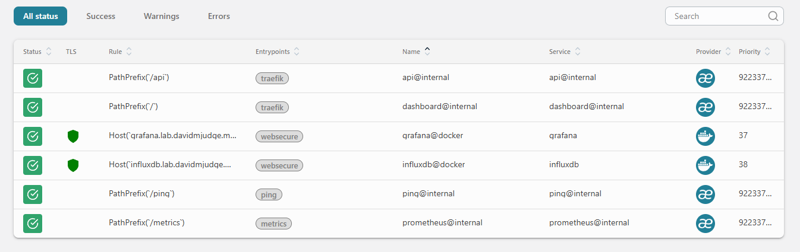
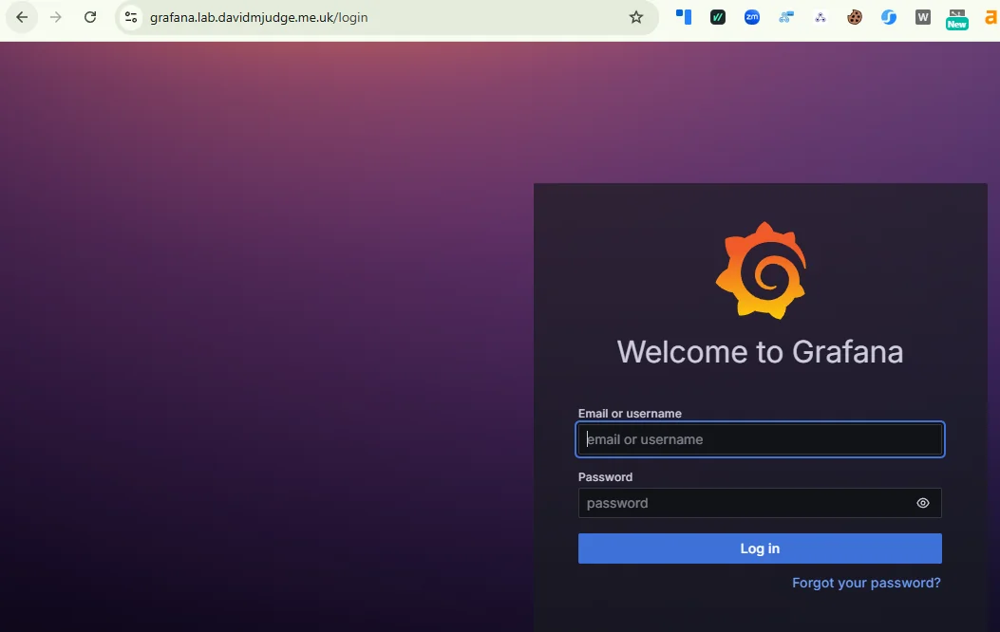
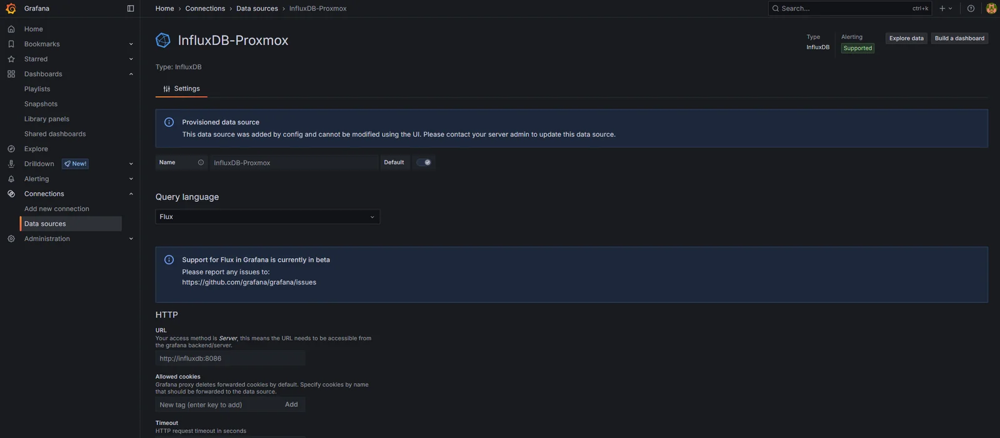
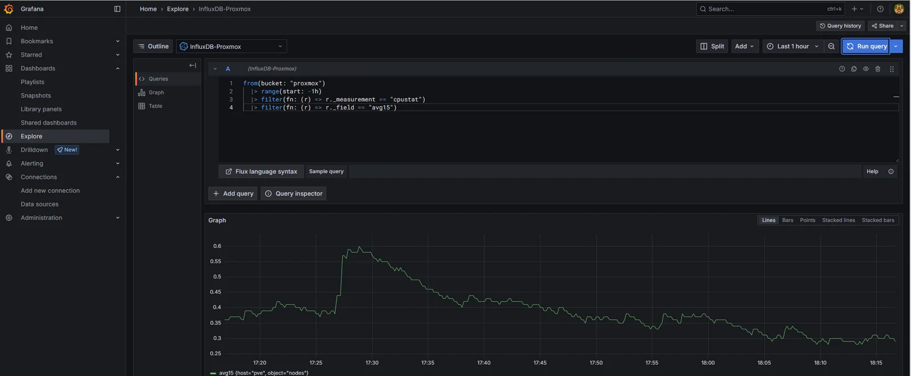
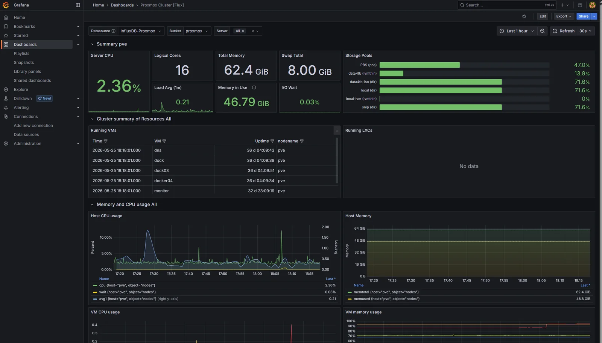
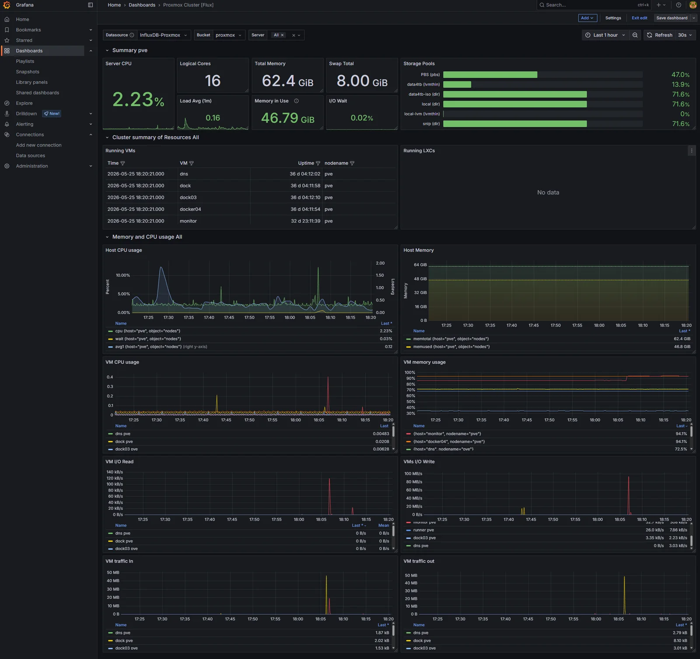

Proxmox has been pushing metrics into InfluxDB for a few days now, and the only way to look at them has been the InfluxDB Data Explorer, which is fine to use as a sanity check. Grafana is the obvious next step: the UI everyone expects, the alerting engine the rest of the stack will lean on, and the place where every later datasource (Prometheus, Loki, Tempo) will eventually plug in side by side.

This post stands up Grafana on the monitor VM, wires it to the existing `proxmox` bucket as a *provisioned* datasource rather than a UI-clicked one, and drops in a community Proxmox dashboard.

<!--more-->

## Image and edition

`grafana/grafana:12.0.2`. The OSS edition, despite the unqualified image name; `grafana/grafana-enterprise` is the licensed one and isn't needed for this stack. Pinned to a specific minor for the same reason InfluxDB is pinned to `2.7`. `latest` is a footgun that turns a routine `docker compose pull` into a surprise migration.

## Why provision the datasource

The instinct on first install is to click through the UI: **Connections** -> **Data sources** -> **Add** -> InfluxDB -> fill in URL, org, bucket, token, save. Five minutes, done.

That datasource then lives inside `data/grafana/grafana.db`. If the data dir ever gets nuked (deliberate redeploy, disk failure, "I'll just blow it away and start fresh") the datasource goes with it and the dashboards on top break silently with "datasource not found". The token sits in a SQLite blob, with no record of what permissions it was granted or what bucket it points at.

Provisioning fixes both. The datasource is declared in a YAML file that's part of the repo. Wiping the data dir and rebooting re-creates it identically. The token still lives in `.env` (because it's a secret) but everything else (the URL, the org, the bucket, the query language version) is in version control.

`stack/02-grafana/provisioning/datasources/influxdb.yml`:

```yaml
apiVersion: 1

datasources:
  - name: InfluxDB-Proxmox
    type: influxdb
    access: proxy
    url: http://influxdb:8086
    jsonData:
      version: Flux
      organization: homelab
      defaultBucket: proxmox
    secureJsonData:
      token: $INFLUXDB_TOKEN_GRAFANA_PROXMOX
    isDefault: true
    editable: false
```

A few things worth calling out:

- **`url: http://influxdb:8086`**. Over the shared `monitoring` Docker network. Grafana resolves the container hostname `influxdb` to the InfluxDB container directly, no Traefik hop, no TLS to terminate twice. Cleaner and faster than going through `https://influxdb.lab.davidmjudge.me.uk`, and avoids the trust dance of a self-signed cert if you ever swap Traefik out.
- **`version: Flux`**. InfluxDB v2's native query language. The datasource also supports InfluxQL for v1 compatibility, but Flux is the one to learn for v2; the bundled Grafana panels and the community dashboards both target Flux.
- **`$INFLUXDB_TOKEN_GRAFANA_PROXMOX`**. Grafana interpolates env vars in provisioning files with a single `$`. The token is passed to the container via env (see compose below), not committed.
- **`editable: false`**. Locks the datasource in the UI. Anyone trying to "just tweak the token" has to come back to this file. Not paranoia; this is the difference between a config-as-code stack and a SQLite stack.
- **`isDefault: true`**. Every dashboard that doesn't specify a datasource explicitly will pick this one up. There's only one for now so it doesn't matter, but setting it now means importing the Proxmox dashboard later doesn't ask awkward questions.

## The compose

`stack/02-grafana/` layout:

```
stack/02-grafana/
├── compose.yaml
├── provisioning/
│   └── datasources/
│       └── influxdb.yml
├── data/                     # gitignored
│   └── grafana/              # /var/lib/grafana
├── README.md
└── .env.example
```

The compose file:

```yaml
---
services:
  grafana:
    image: grafana/grafana:12.0.2
    container_name: grafana
    hostname: grafana.lab.davidmjudge.me.uk
    restart: unless-stopped
    environment:
      - TZ=Europe/London
      - GF_SECURITY_ADMIN_USER=${GRAFANA_ADMIN_USER}
      - GF_SECURITY_ADMIN_PASSWORD=${GRAFANA_ADMIN_PASSWORD}
      - GF_SERVER_ROOT_URL=https://grafana.lab.davidmjudge.me.uk
      - GF_USERS_ALLOW_SIGN_UP=false
      - GF_ANALYTICS_REPORTING_ENABLED=false
      - GF_ANALYTICS_CHECK_FOR_UPDATES=false
      - INFLUXDB_TOKEN_GRAFANA_PROXMOX=${INFLUXDB_TOKEN_GRAFANA_PROXMOX}
    volumes:
      - ./data/grafana:/var/lib/grafana
      - ./provisioning:/etc/grafana/provisioning:ro
    labels:
      - "traefik.enable=true"
      - "traefik.http.routers.grafana.rule=Host(`grafana.lab.davidmjudge.me.uk`)"
      - "traefik.http.routers.grafana.entrypoints=websecure"
      - "traefik.http.routers.grafana.tls=true"
      - "traefik.http.routers.grafana.tls.certresolver=cloudflare"
      - "traefik.http.routers.grafana.middlewares=secure-headers@file"
      - "traefik.http.services.grafana.loadbalancer.server.port=3000"
    networks:
      - proxy
      - monitoring

networks:
  proxy:
    external: true
  monitoring:
    external: true
```

Worth calling out:

- **`GF_SERVER_ROOT_URL`**. Grafana uses this to build absolute URLs for share links, alert callbacks, and OAuth redirects. Without it, Grafana falls back to whatever the request came in on, which often produces broken links from alert notifications (Alertmanager doesn't see the original `Host` header). Set it once, set it correctly.
- **`GF_USERS_ALLOW_SIGN_UP=false`**. Grafana ships with self-signup enabled. On a public-facing host with a real Let's Encrypt cert that's a small open door. Close it.
- **Analytics off.** `GF_ANALYTICS_REPORTING_ENABLED` and `GF_ANALYTICS_CHECK_FOR_UPDATES` both off, the same instinct as `sendAnonymousUsage: false` in Traefik's static config.
- **`INFLUXDB_TOKEN_GRAFANA_PROXMOX`** is plain env, not `secureJsonData`-style: Grafana reads the env var, then the provisioning file consumes it. There's nothing to gain by making it a Docker secret in a single-node compose stack.
- **No `ports:`.** Grafana listens on `:3000` inside the container; Traefik routes from `https://grafana.lab.davidmjudge.me.uk`.
- **Both networks.** `proxy` for Traefik ingress, `monitoring` so Grafana can reach `influxdb:8086` over the internal backplane (and Prometheus, Loki, Tempo when they arrive).

## `.env`

```
GRAFANA_ADMIN_USER=admin
GRAFANA_ADMIN_PASSWORD=

# Read-only token scoped to the proxmox bucket.
INFLUXDB_TOKEN_GRAFANA_PROXMOX=
```

A note on the admin password. Grafana's first-boot bootstrap reads `GF_SECURITY_ADMIN_PASSWORD` and sets the admin user accordingly. After that, changing the env var has no effect. The credential lives in Grafana's SQLite. If you want to rotate it later, change it in the UI; if you want to reset a forgotten one, `docker compose exec grafana grafana-cli admin reset-admin-password <new>` does the job.

## The read-only token

Grafana only ever reads from InfluxDB. The token it gets needs to reflect that. If the admin token leaks the blast radius is the whole InfluxDB instance; a token scoped to read one bucket is essentially a query device.

In the InfluxDB UI:

1. **Load Data** -> **API Tokens** -> **Generate API Token** -> **Custom API Token**
2. **Description:** `grafana-proxmox-read`
3. **Bucket permissions:** `proxmox` -> tick **Read** only (leave Write unticked)
4. **Generate**, copy the token immediately. Only shown once.

Paste into `INFLUXDB_TOKEN_GRAFANA_PROXMOX` in `.env`.

## Bringing it up

First, update the DNS by creating a CNAME entry, so the ACME challenge can resolve. On the `dns` host, in the zone file:

```
grafana   IN  CNAME  monitor.lab.davidmjudge.me.uk.
```

Then from the workstation:

```bash
ssh monitor 'mkdir -p ~/grafana'
rsync -av --exclude='.env' --exclude='data/' stack/02-grafana/ monitor:~/grafana/
```

On monitor:

```bash
cd ~/grafana
cp .env.example .env
$EDITOR .env                       # set admin password + paste the read-only token

# Grafana runs as UID 472 in the container. Bind-mount needs to be writable
# by that UID, so pre-create and chown it. If Docker creates the dir, it'll
# be root-owned and Grafana will crash-loop on first boot.
mkdir -p data/grafana
sudo chown -R 472:472 data/grafana

docker compose up -d
docker compose logs -f grafana     # watch for "HTTP Server Listen"
```

Traefik issues the Let's Encrypt cert via the Cloudflare DNS challenge automatically. First request to the URL might take a few seconds.

In the Traefik dashboard at `http://traefik-monitor.lab.davidmjudge.me.uk:8080/dashboard/`, the `grafana@docker` router should appear green with TLS active and bound to `websecure`.



Open `https://grafana.lab.davidmjudge.me.uk` and sign in.



## Reading the bind-mount without sudo

The chown locked the data dir to UID 472. Good for Grafana, awkward for the human who wants to peek at the SQLite database or tail a log file without typing `sudo` every time. The portable fix is a host group with GID 472 and your shell user as a member.

On the monitor VM:

```bash
sudo groupadd -g 472 grafana
sudo usermod -aG grafana $USER
```

Then log out and back in. Group membership only attaches to new login sessions; the shell that ran `usermod` won't pick it up until SSH starts a fresh one. Verify with `id`:

```bash
id
# uid=1000(david) gid=1000(david) groups=1000(david),472(grafana)
```

Now make the bind-mount group-readable:

```bash
sudo chmod -R g+rX data/grafana
```

Capital `X` adds traverse on directories and read on files but doesn't make ordinary data files executable.

That covers the files that already exist. Grafana keeps writing new ones (session blobs, the alert state DB, log rotations) and those inherit their permissions from the container's umask. Today that umask happens to allow group read, but it isn't a contract; an image upgrade could tighten it and silently strip your access. The robust fix is a *default* ACL, which forces every new file and directory created inside the tree to inherit group-read regardless of the process umask:

```bash
sudo setfacl -R -d -m g:472:rX data/grafana
```

Verify:

```bash
getfacl data/grafana | grep default
# default:group:472:r-x
```

`ls -la data/grafana` and `cat data/grafana/log/grafana.log` now work as your normal user.

One thing this isn't. Don't *write* to those files while Grafana is running. SQLite under live access gives a stale snapshot at best and corruption at worst. The point here is diagnostics, not a shared edit workflow.

The same pattern repeats for every later step. Loki's image runs as UID 10001, Prometheus as 65534 (the conventional "nobody" UID), Tempo as another value again. Each stack gets a host group at the matching GID, your user joins it once, and the bind-mount is made group-readable the same way. A small one-time chore that pays off every time you want to poke at a data dir without sudo.

A couple of alternatives considered and not chosen:

- **Named Docker volumes** would side-step the host-side ownership problem entirely (Docker chowns them on creation), but the volume lives somewhere under `/var/lib/docker/volumes/`, and rummaging in there as a normal user defeats the purpose. The bind-mount-plus-group pattern keeps the data dir somewhere you can `cd` into without `docker volume inspect`.
- **Userns-remap** in the Docker daemon maps every container UID into a private host range. Cleaner isolation, but it's a daemon-level toggle that affects every container on the host. Reasonable for a hardening pass later; overkill for adding a group on a homelab.

## Verifying the provisioned datasource

**Connections** -> **Data sources**. `InfluxDB-Proxmox` should be there with a "Provisioned" tag. Open it: the URL, org, default bucket, and Flux version should match the file. The token field is greyed out (it came from env). The whole config is read-only. The **Save & Test** button at the bottom is the only thing you can do. Click it.



If the test fails:

1. **`bad request: organisation not found`**. The org name in the provisioning file doesn't match what InfluxDB has. Check the value in InfluxDB UI -> top-left dropdown.
2. **`unauthorized: invalid token`**. The env var isn't getting through. `docker compose exec grafana env | grep INFLUXDB` should show the token value; if it's empty, `.env` isn't being read.
3. **`connection refused`**. The URL is wrong, or the `monitoring` network isn't shared. `docker compose exec grafana wget -O- http://influxdb:8086/health` should return `{"status":"pass",...}`.

## A smoke-test query

Before importing a dashboard, sanity-check that Grafana can actually pull data. **Explore** -> select `InfluxDB-Proxmox` -> drop this into the Flux editor:

```flux
from(bucket: "proxmox")
  |> range(start: -1h)
  |> filter(fn: (r) => r._measurement == "cpustat")
  |> filter(fn: (r) => r._field == "avg15")
```

Run query. A line, one point every 10 seconds, going back an hour. Same data as the InfluxDB Data Explorer, just one tab over.



## Importing a Proxmox dashboard

There are a few community dashboards on grafana.com for Proxmox-via-InfluxDB-v2. The most widely used at the time of writing is dashboard ID **15356** (search "proxmox influxdb flux" on grafana.com to confirm; the IDs change as authors revise).

**Dashboards** -> **New** -> **Import** -> paste `15356` -> **Load** -> select `InfluxDB-Proxmox` as the datasource -> **Import**.

What lands is dense: dozens of panels, every metric Proxmox exports, multiple variables for selecting node/VM/storage. Useful as a reference, overwhelming as a daily driver.



The instinct to leave it untouched and call the job done is wrong. A dashboard you didn't shape is a dashboard you don't actually understand. Two changes worth making before this becomes the homepage:

1. **Cull.** Remove every panel that's never going to be the answer to a real question. The per-CPU breakdown panels go; aggregate CPU is enough. The per-process panels go; if a process is causing a problem, it'll show up on host load. The dashboard goes from 30+ panels to about 12.
2. **Reorder.** The top row should answer "is the host healthy" (CPU, memory, load), the second row "are the VMs healthy" (per-VM CPU/memory rollups), the rest is reference material. Anyone glancing at the dashboard during an incident should get the answer in the first viewport.

Save the modified dashboard as a copy with a new name like `Proxmox - Homelab`. The original import stays as a reference.



## Why dashboards aren't (yet) provisioned

Datasource provisioning was a freebie: one short YAML file, one read-only token, done. Dashboard provisioning is a deeper commitment. The dashboard JSON is long, generated by the UI editor, and changes every time you nudge a panel. Treating it as source code means either accepting messy diffs after every edit, or building a workflow that exports + commits the JSON on every save.

That's worth doing. It's just not worth doing yet. The dashboard list is small, the alerts haven't been written, and the right time to lock everything down as code is after the shape has stabilised. The harden-the-platform post a few steps from here is where dashboard JSON, alert rules, and notification policies all get pulled into provisioning together.

## Where we are

Three steps in: Traefik, [InfluxDB collecting Proxmox metrics](), and Grafana on top reading them through a provisioned datasource, with a trimmed dashboard that answers "is everything healthy" at a glance.

## What's next

Prometheus. Pull-based scraping for everything that isn't Proxmox: node_exporter on every host, Traefik's `/metrics` endpoint (which has been sitting unused since step 0), and the first application-level metrics. Grafana picks it up as a second datasource alongside InfluxDB, and the split-tier observability pattern (InfluxDB for traditional infrastructure, Prometheus for ingress and apps) becomes visible.
