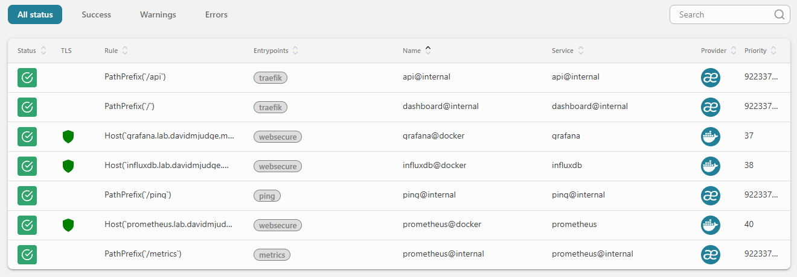
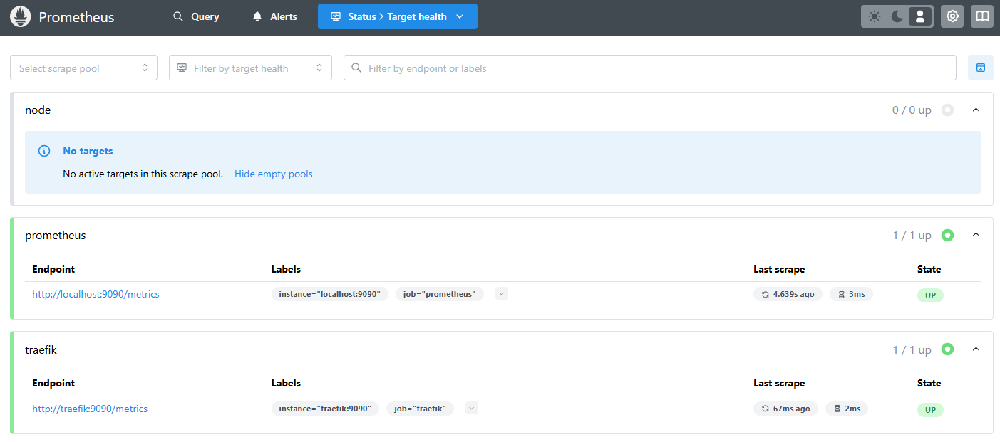
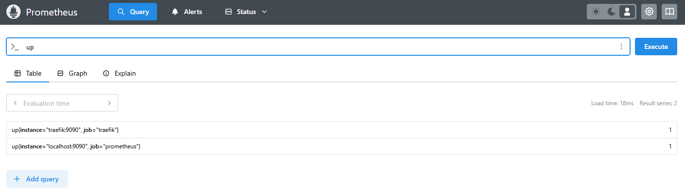
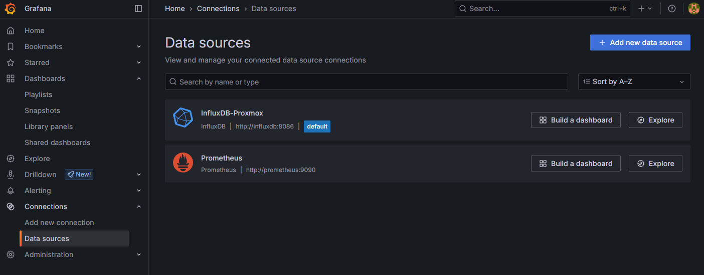
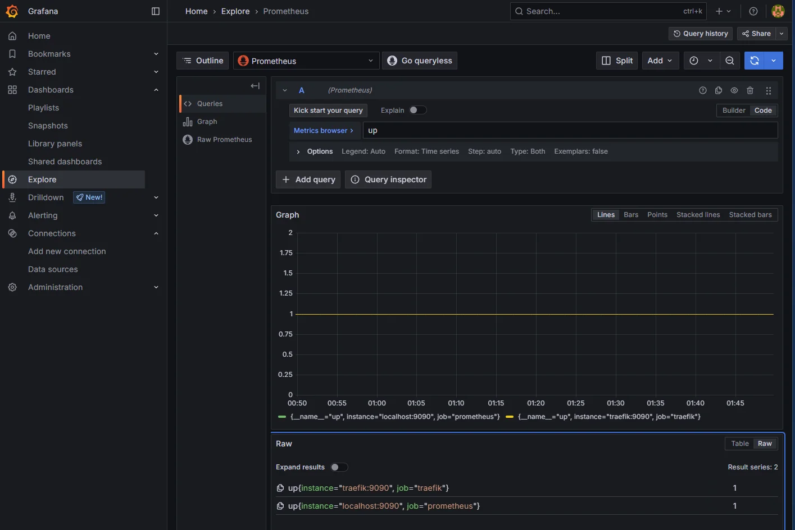

Traefik has been emitting Prometheus metrics on its dedicated `:9090` entrypoint since step 0, and nothing has been reading them. That's the visible symptom of a deliberate gap in the stack: the Proxmox-via-InfluxDB path is fine for hypervisor metrics, but a homelab observability platform needs a pull-based scraper for everything else. Traefik's request counts, node_exporter on every VM, Blackbox probes, application instrumentation later on. All of it expects Prometheus.

This post stands up Prometheus on the monitor VM behind Traefik, points it at Traefik as the first scrape target, and wires it into Grafana as a second provisioned datasource alongside the InfluxDB one from last time.

<!--more-->

## Two metric stores isn't a mistake

The instinct on seeing both InfluxDB and Prometheus in the same stack is to flatten one of them into the other. Pick a side, run one timeseries database, move on. I've made that call differently here and it's worth saying why up front.

Proxmox ships with a native InfluxDB exporter. Datacenter -> Metric Server -> point at a URL, paste a token, done. Every hypervisor counter, every guest, every storage measurement flows in over UDP with a ten-second cadence and zero glue code. Migrating that to Prometheus means standing up Telegraf or `proxmox-exporter` as a bridge, maintaining the metric mapping, and accepting that the bridge becomes another component to monitor. The juice isn't worth the squeeze.

Prometheus is the right tool for everything that isn't Proxmox. Traefik exports `/metrics` natively. node_exporter exists for every Linux host. Blackbox is the right shape for endpoint probes. Application code in any modern language has a Prometheus client library in three lines. The cloud-native ecosystem is pull-based and Prometheus is its lingua franca; fighting that for the sake of "one database to rule them all" trades convenience for a worse outcome.

So: InfluxDB is the push-based sink for things that want to send (Proxmox, eventually anything legacy). Prometheus is the scraper for things that want to be read. Grafana sits over both and a panel can pull from either without the dashboard reader caring which.

## Image and edition

`prom/prometheus:v3.1.0`. v3 has been the recommended line for the best part of a year now, with v2.x in maintenance; the TSDB format is forward-compatible and the PromQL changes that matter for a fresh build are wins (`info` function for joins, native histograms stable). Pinned to a specific minor for the same reason Grafana and InfluxDB are pinned: `latest` is a trap that turns a routine `docker compose pull` into a surprise migration.

## The compose

Layout:

```
stack/03-prometheus/
├── compose.yaml
├── config/
│   ├── prometheus.yml         # global config + scrape_configs
│   └── targets/               # file-based service discovery
│       └── .gitkeep
├── data/                      # gitignored
│   └── prometheus/            # /prometheus (TSDB blocks + WAL)
├── README.md
└── .env.example
```

The compose file:

```yaml
---
services:
  prometheus:
    image: prom/prometheus:v3.1.0
    container_name: prometheus
    hostname: prometheus.lab.davidmjudge.me.uk
    restart: unless-stopped
    user: "65534:65534"
    environment:
      - TZ=Europe/London
    command:
      - "--config.file=/etc/prometheus/prometheus.yml"
      - "--storage.tsdb.path=/prometheus"
      - "--storage.tsdb.retention.time=${PROMETHEUS_RETENTION:-30d}"
      - "--web.external-url=https://prometheus.lab.davidmjudge.me.uk"
      - "--web.enable-lifecycle"
    volumes:
      - ./data/prometheus:/prometheus
      - ./config/prometheus.yml:/etc/prometheus/prometheus.yml:ro
      - ./config/targets:/etc/prometheus/targets:ro
    labels:
      - "traefik.enable=true"
      - "traefik.http.routers.prometheus.rule=Host(`prometheus.lab.davidmjudge.me.uk`)"
      - "traefik.http.routers.prometheus.entrypoints=websecure"
      - "traefik.http.routers.prometheus.tls=true"
      - "traefik.http.routers.prometheus.tls.certresolver=cloudflare"
      - "traefik.http.routers.prometheus.middlewares=secure-headers@file"
      - "traefik.http.services.prometheus.loadbalancer.server.port=9090"
    networks:
      - proxy
      - monitoring

networks:
  proxy:
    external: true
  monitoring:
    external: true
```

Worth calling out:

- **`--web.external-url=https://prometheus.lab.davidmjudge.me.uk`** is the single setting that makes the UI behave correctly behind a reverse proxy. Without it, Prometheus generates redirects and absolute UI links against `http://prometheus:9090`, which doesn't resolve from a browser, and clicking from Status -> Targets to the graph view dumps you on a broken URL. Path prefix stays `/`, so no `--web.route-prefix` is needed.
- **`--web.enable-lifecycle`** opens `POST /-/reload` so config edits don't need a container restart. The trade-off is real and worth being explicit about: the same flag also exposes `POST /-/quit` for graceful shutdown. On the trusted homelab LAN that's an acceptable risk for the operational win; the day the trust boundary widens, the right answer is a Traefik `basicAuth` middleware on this router rather than disabling the flag.
- **`user: "65534:65534"`.** The image already runs as `nobody` (UID 65534); declaring it in compose is for the reader. Pairs with the chown step in the bring-up below.
- **`./config/targets:/etc/prometheus/targets:ro`** mounts an empty directory today. The point is that adding the next node_exporter target won't need a compose edit.
- **No Grafana-style admin password env vars.** Prometheus has no built-in auth. The homelab convention here is "trusted LAN, services without built-in auth still get a Traefik route". Same call as Traefik's own dashboard. When external access matters, the same `basicAuth` middleware that covers `/-/quit` covers the UI.

## `.env`

```
PROMETHEUS_RETENTION=30d
```

That's it. No admin user to seed, no token to mint, no first-boot bootstrap. Retention defaults to 30d to match the InfluxDB bucket, so the two stores age out together. Bump to 90d or 1y once the disk usage curve is known; long-term retention is a different problem (Mimir, Thanos) and a much later post.

## The scrape config

The Prometheus config:

```yaml
global:
  scrape_interval: 15s
  evaluation_interval: 15s
  external_labels:
    homelab: monitor

scrape_configs:
  - job_name: prometheus
    static_configs:
      - targets: ['localhost:9090']

  - job_name: traefik
    static_configs:
      - targets: ['traefik:9090']

  - job_name: node
    file_sd_configs:
      - files:
          - /etc/prometheus/targets/node-*.json
        refresh_interval: 1m
```

Three jobs, two patterns.

**Static configs for things that won't move.** Prometheus self-scrapes via `localhost:9090` and reaches Traefik's metrics endpoint at `traefik:9090` over the shared `monitoring` Docker network. Both targets are part of the platform itself; if either of them stops existing the whole stack has bigger problems than its scrape config. Hard-coded targets are fine and the file stays readable.

**File-SD for everything else.** The `node` job points at a glob, not a list. Adding a node_exporter host means dropping a JSON file in `config/targets/` and calling `POST /-/reload`. No edit to `prometheus.yml`, no Prometheus restart, no merge conflict between two people adding hosts at the same time. The agent-install workflow for the next post becomes a single template plus one curl.

**`external_labels: homelab: monitor`.** Tags every metric Prometheus stores with the source instance. Pointless with one Prometheus, important the moment a second one shows up (a remote site, an isolated network, a duplicate for high availability) and the central Grafana needs to know which Prometheus a series came from. Setting it now costs nothing and means future-me doesn't have to re-tag historical data.

**Scrape interval at 15s.** Default. Tighter intervals (5s, 1s) make sense for fast-moving counters but cost roughly 3x the disk and 3x the cardinality work for marginal incident-response value. 15s is what most production setups land on; no reason to deviate.

## Bringing it up

CNAME first, so the ACME challenge can resolve. On the `dns` host, in the zone file:

```
prometheus   IN  CNAME  monitor.lab.davidmjudge.me.uk.
```

Then from the workstation:

```bash
ssh monitor 'mkdir -p ~/prometheus'
rsync -av --exclude='.env' --exclude='data/' stack/03-prometheus/ monitor:~/prometheus/
```

On monitor:

```bash
cd ~/prometheus
cp .env.example .env
# Default retention is fine; nothing to edit unless you want to change it.

# Prometheus runs as UID 65534 (nobody) inside the container. Pre-create and
# chown the data dir so it isn't root-owned when Docker creates it.
mkdir -p data/prometheus
sudo chown -R 65534:65534 data/prometheus

docker compose up -d
docker compose logs -f prometheus     # watch for "Server is ready to receive web requests"
```

Traefik issues the Let's Encrypt cert via the Cloudflare DNS challenge automatically, same as every previous stack.

In the Traefik dashboard at `http://traefik-monitor.lab.davidmjudge.me.uk:8080/dashboard/`, the `prometheus@docker` router should appear green with TLS active and bound to `websecure`.



Open `https://prometheus.lab.davidmjudge.me.uk/targets`. The `prometheus` and `traefik` jobs should both show `UP`, with a recent scrape timestamp and no scrape errors.



The `node` job shows zero targets and that's correct. The job exists, the file-SD glob is in place, no host has signed up yet. It'll fill in one entry at a time as agents land.

A one-liner sanity check from the Graph tab:

```promql
up
```

Two series, both at `1`. That's end-to-end: Prometheus is up, it scraped itself, it scraped Traefik, Traefik responded with a metrics payload that parsed cleanly.



## Wiring Grafana as a second datasource

Last post provisioned InfluxDB-Proxmox as Grafana's default datasource. Adding Prometheus alongside it is one more YAML file in the same directory.

The Prometheus datasource:

```yaml
apiVersion: 1

datasources:
  - name: Prometheus
    type: prometheus
    access: proxy
    url: http://prometheus:9090
    jsonData:
      httpMethod: POST
      prometheusType: Prometheus
      prometheusVersion: 3.1.0
    isDefault: false
    editable: false
```

The shape mirrors the InfluxDB datasource file from the previous post and the same arguments apply: source-of-truth lives in the repo, the UI shows it as locked, a wipe of `data/grafana/` reproduces it identically. A few things specific to Prometheus:

- **`url: http://prometheus:9090`** over the shared `monitoring` network, same internal-hostname pattern Grafana uses to reach InfluxDB. No Traefik hop, no TLS to terminate twice.
- **`httpMethod: POST`** is the modern recommendation. GET works up to a URL-length ceiling; POST handles big PromQL queries without hitting it. There's no down-side at this scale.
- **No `secureJsonData`.** Prometheus has no auth, so there's no token to interpolate. If a `basicAuth` middleware ever wraps the Traefik router, the datasource gets `basicAuth: true` and a `secureJsonData.basicAuthPassword` block, but it's worth landing the plain version first and adding hardening as its own deliberate step.
- **`isDefault: false`.** InfluxDB-Proxmox stays the default. Both datasources are queryable, but a freshly created panel that doesn't specify one still defaults to the same place as before. Avoids a subtle "all my old dashboards just changed datasource" surprise.

Pick the file up with a restart of the Grafana stack:

```bash
cd ~/grafana
docker compose restart grafana
```

In Grafana, **Connections** -> **Data sources**. Both `InfluxDB-Proxmox` and `Prometheus` should be listed with a "Provisioned" tag. Open the new one and click **Save & Test** at the bottom. "Successfully queried the Prometheus API." is the expected response.



## Smoke test from Grafana

The same `up` query, run from Grafana this time. **Explore** -> select `Prometheus` -> paste:

```promql
up
```

Two series, both at `1`. Same answer Prometheus's own Graph tab gave, just one tab over and with the Grafana time picker on top. That's the proof that Grafana can ask Prometheus a question and get a sensible answer back.



A second query worth running to make sure Traefik's exporter is producing useful data, not just an empty `/metrics`:

```promql
traefik_router_request_duration_seconds_count
```

A handful of series per Traefik router, each counting requests. If you've been clicking around the homelab in the last fifteen minutes the counters will be non-zero. The fact that this metric exists at all is the validation that Traefik's Prometheus integration is wired correctly, which has been "configured but unverified" since step 0.

## Adding a target without a restart

The agent-install post is next, but the file-SD workflow is worth demonstrating now, even with a placeholder target. On the monitor VM:

```bash
cd ~/prometheus
cat > config/targets/node-monitor.json <<'EOF'
[
  {
    "targets": ["monitor.lab.davidmjudge.me.uk:9100"],
    "labels": { "host": "monitor", "role": "monitor-vm" }
  }
]
EOF

curl -X POST https://prometheus.lab.davidmjudge.me.uk/-/reload
```

The `node` job in Status -> Targets now lists one target. It'll be `DOWN` until node_exporter is actually installed on the monitor VM, which is the explicit subject of the next post. The point here is the mechanism: a JSON drop and one curl, no compose edit, no scrape config diff, no Prometheus restart.

## Where we are

Four steps in: Traefik, [InfluxDB collecting Proxmox metrics](), [Grafana on top](), and now Prometheus scraping Traefik with Grafana picking it up as a second provisioned datasource alongside InfluxDB.

## What's next

node_exporter on every VM, distributed via Ansible and registered with Prometheus through the file-SD pattern shown above. One JSON file per host, dropped in place by the playbook, picked up by Prometheus's next refresh tick. By the end of that post the `up` query returns a row per VM instead of the two it shows today, and the first proper "is this host healthy" dashboard goes onto Grafana.
