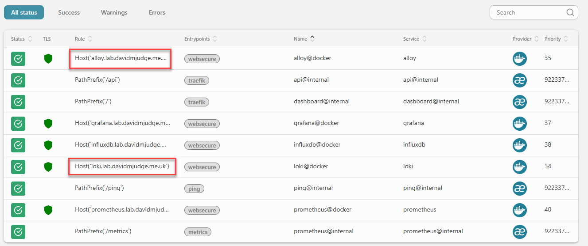
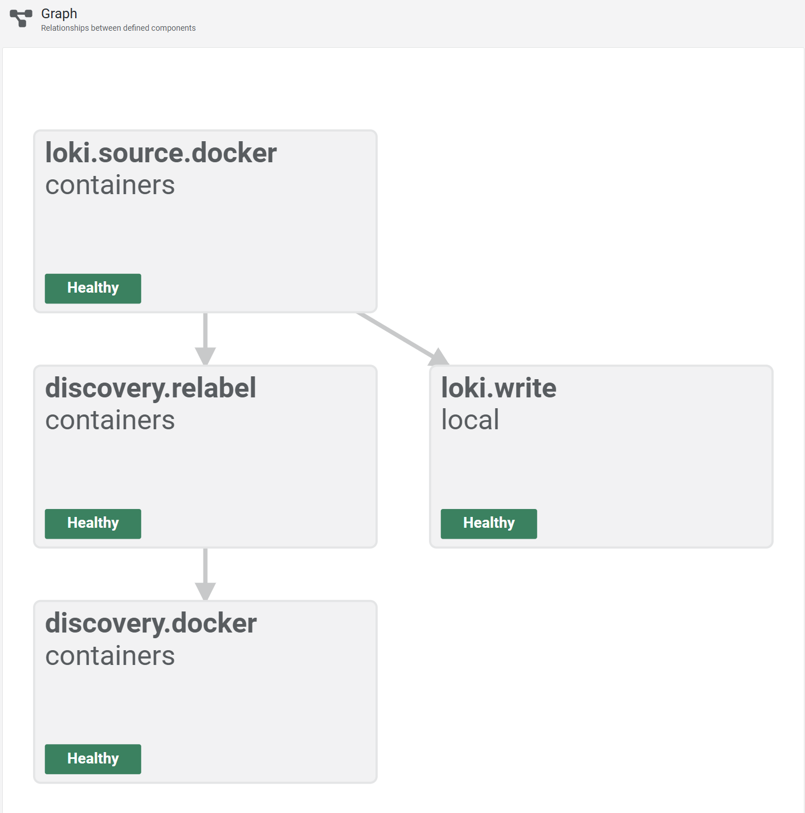
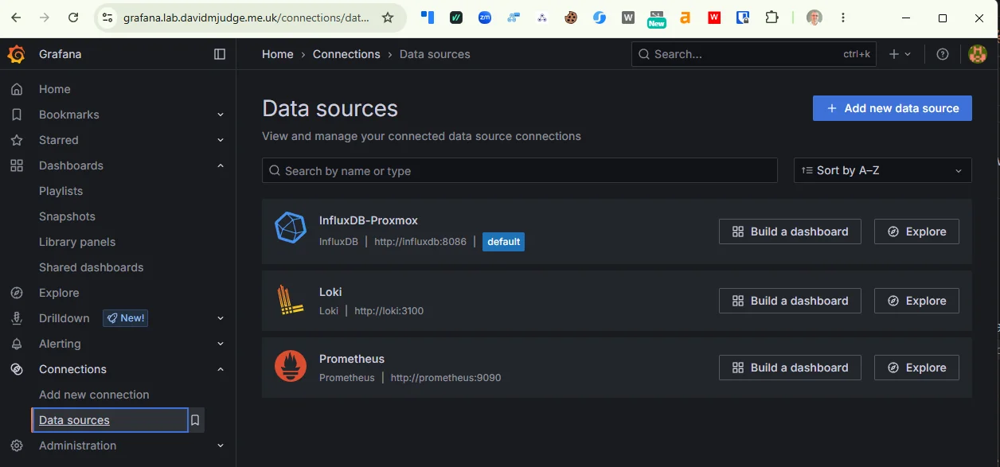
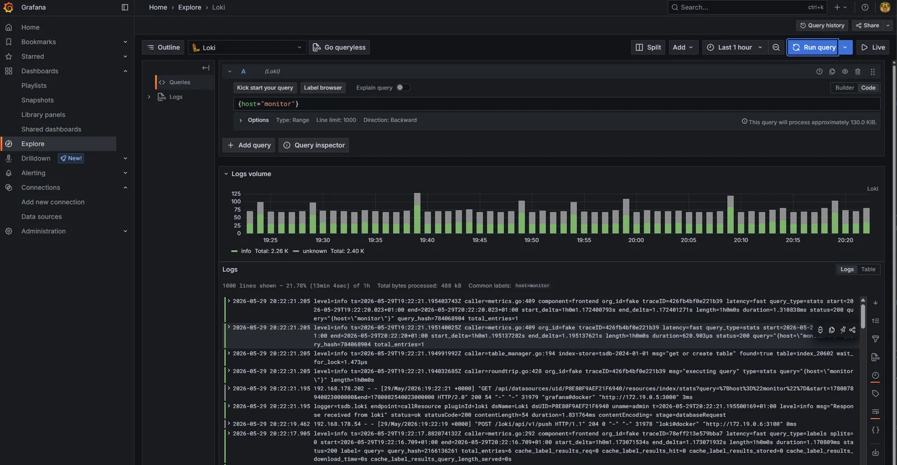
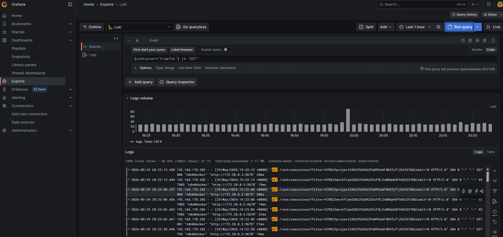

Five containers have been printing useful things to stdout for the last four posts and none of it has been captured or made queryable. Traefik logs every routed request, Prometheus complains noisily when a scrape target goes away, Grafana names the user behind each provisioning reload, and the only way to read any of it has been `docker compose logs -f` on the monitor VM. That's a tactical answer that works when there's one host. It stops working the moment Alloy rolls to a second VM and "ssh to whichever box might have the answer" turns into a hunt across every box.

This post stands up Loki on the monitor VM behind Traefik, drops Grafana Alloy alongside it as a per-host log shipper, and wires it into Grafana as a third provisioned datasource so LogQL queries land next to the PromQL ones from last time.

<!--more-->

In the next post, we'll cover how to get Alloy to collect from a different host - see [Rolling Alloy to a host]()

## The stack so far


flowchart LR
    PX["Proxmox"]
    Client["LAN clients"]
    subgraph monitor["Monitor VM"]
        TR["Traefik"]
        IDB[("InfluxDB")]
        PR[("Prometheus")]
        LK[("Loki")]:::new
        AL["Alloy"]:::new
        GF["Grafana"]
    end
    PX -->|HTTPS| TR
    Client -->|HTTPS UI| TR
    TR --> IDB
    TR --> PR
    TR --> LK
    TR --> GF
    PR -.->|scrape| TR
    AL -.->|push logs| LK
    GF -.->|query| IDB
    GF -.->|query| PR
    GF -.->|query| LK
    classDef new stroke:#2e7d32,stroke-width:3px,fill:#c8e6c9;


Loki is the log store; Alloy reads every container's stdout from the Docker daemon socket and pushes to Loki. Grafana now queries three signal stores from the same UI.

## A store and an agent, both deliberate

Centralised logging is two decisions, not one. The store is the easier call: Loki is the de-facto choice in a Grafana-first stack, the LogQL syntax stays close enough to PromQL that the muscle memory transfers, and a homelab volume of logs (~weeks from a handful of VMs) sits comfortably inside what a single-binary deployment can carry. The harder call is the agent, because Grafana's own log-shipper situation has been in flux for the better part of a year.

The agent of record used to be Promtail. The Grafana Agent existed alongside it for metrics, plus a separate OpenTelemetry Collector if you wanted traces. In 2024 Grafana pulled all three jobs into one binary called Alloy and put Promtail and Grafana Agent into maintenance mode. New deployments are pointed at Alloy.

I'm starting from Alloy here for one reason: when this stack reaches steps 7 to 9 and starts emitting OTLP metrics and traces, the same agent process picks those up too. Promtail can't. Standing up Promtail today would mean migrating it in two posts' time, and an unforced agent migration on a homelab observability stack is exactly the kind of avoidable churn the SME framing of this series is meant to design out. The cost of Alloy is a slightly newer config language (river-style HCL instead of YAML) and a smaller pool of blog posts to copy from. Worth paying once.

## Single-binary Loki, filesystem storage

Loki ships in two deployment shapes. Single-binary runs everything in one process against local disk. Microservices mode splits the ingester, distributor, querier, compactor, and index gateway into separate workloads behind S3-compatible object storage. The microservices guide is the one Grafana lead with on their docs site and the one most production write-ups describe. It's also dramatic overkill for any volume of logs you can carry on one VM.

The data layout on disk is the same in both modes. Loki writes TSDB index blocks and chunked log files using the v13 schema, and a single-binary deployment using filesystem storage produces files that microservices-mode Loki can read without conversion. The move from "one container, one disk" to "five containers, one S3 bucket" is a deployment-topology change rather than a data migration, which means starting simple isn't a trap I'll have to dig out of later.

So: single-binary today, filesystem storage on a bind mount, the same TSDB v13 schema microservices mode uses. If the homelab ever generates enough logs to justify scaling out, the chunks already on disk go straight into S3 and the deployment grows around them.

## The compose

Layout:

```
stack/04-loki/
├── compose.yaml
├── config/
│   ├── loki-config.yaml          # single-binary, TSDB v13, filesystem
│   └── alloy-config.alloy        # Docker discovery -> Loki write
├── data/                         # gitignored
│   ├── loki/                     # /loki (chunks, index, compactor)
│   └── alloy/                    # /alloy-data
└── README.md
```

The compose file:

```yaml
---
services:
  loki:
    image: grafana/loki:3.3.2
    container_name: loki
    hostname: loki.lab.davidmjudge.me.uk
    restart: unless-stopped
    user: "10001:10001"
    environment:
      - TZ=Europe/London
    command:
      - "-config.file=/etc/loki/loki-config.yaml"
    volumes:
      - ./data/loki:/loki
      - ./config/loki-config.yaml:/etc/loki/loki-config.yaml:ro
    labels:
      - "traefik.enable=true"
      - "traefik.http.routers.loki.rule=Host(`loki.lab.davidmjudge.me.uk`)"
      - "traefik.http.routers.loki.entrypoints=websecure"
      - "traefik.http.routers.loki.tls=true"
      - "traefik.http.routers.loki.tls.certresolver=cloudflare"
      - "traefik.http.routers.loki.middlewares=secure-headers@file"
      - "traefik.http.services.loki.loadbalancer.server.port=3100"
    networks:
      - proxy
      - monitoring

  alloy:
    image: grafana/alloy:v1.5.1
    container_name: alloy
    hostname: alloy.lab.davidmjudge.me.uk
    restart: unless-stopped
    user: "10001:${DOCKER_GID}"
    environment:
      - TZ=Europe/London
      - HOME=/alloy-data
    command:
      - "run"
      - "--server.http.listen-addr=0.0.0.0:12345"
      - "--storage.path=/alloy-data"
      - "/etc/alloy/config.alloy"
    volumes:
      - ./data/alloy:/alloy-data
      - ./config/alloy-config.alloy:/etc/alloy/config.alloy:ro
      - /var/run/docker.sock:/var/run/docker.sock:ro
    labels:
      - "traefik.enable=true"
      - "traefik.http.routers.alloy.rule=Host(`alloy.lab.davidmjudge.me.uk`)"
      - "traefik.http.routers.alloy.entrypoints=websecure"
      - "traefik.http.routers.alloy.tls=true"
      - "traefik.http.routers.alloy.tls.certresolver=cloudflare"
      - "traefik.http.routers.alloy.middlewares=secure-headers@file"
      - "traefik.http.services.alloy.loadbalancer.server.port=12345"
    networks:
      - proxy
      - monitoring
    depends_on:
      - loki

networks:
  proxy:
    external: true
  monitoring:
    external: true
```

Two services because there's no useful intermediate state where one is up and the other isn't. Loki without an agent is an empty database; Alloy without Loki retries forever and fills its disk. `depends_on: loki` makes the boot order explicit so the Alloy logs don't show fifteen seconds of "connection refused" on every `docker compose up`.

A few specifics worth calling out:

- **`user: "10001:10001"` on Loki.** The image runs as UID 10001 (`loki`) by default. Declaring it in compose is for the reader and pairs with the chown step in the bring-up below, same pattern Grafana (472) and Prometheus (65534) used.
- **`user: "10001:${DOCKER_GID}"` on Alloy.** The bigger of the two decisions in this file. Detail in its own section below; the short version is that Alloy runs as a non-root UID with the host's `docker` group GID as its primary group, which is the minimum privilege Alloy needs to read the Docker socket and not a byte more.
- **Only the Docker socket is mounted, not `/var/lib/docker/containers/`.** Worth flagging because it's the muscle-memory mistake from Promtail. `loki.source.docker` reads logs through the Docker daemon's HTTP API, not by tailing the on-disk JSON log files, so the second mount adds no capability. Detail in the non-root section below.
- **`--storage.path=/alloy-data` and `HOME=/alloy-data`, both at the filesystem root.** A top-level mount path Alloy fully owns, rather than nesting under the image's own `/var/lib/alloy/`. Detail in its own section below; the short version is that the image creates `/var/lib/alloy/` as root-owned 0755, and a non-root Alloy's `remotecfg` service init throws a misleading "permission denied" when its storage path sits under there.
- **Alloy's UI on `:12345` exposed via Traefik.** Same trusted-LAN call as Prometheus in the [previous post](). The component-graph view at the Alloy URL is the single most useful debugging surface for "why aren't logs arriving", and inspecting it through SSH tunnels would be friction for no gain.

## Running Alloy as non-root

This is the bit of the stack I spent the longest thinking about and the bit I most want to talk about, because the lazy answer is wrong and every Promtail tutorial on the internet trains the muscle memory the wrong way.

The lazy answer is `user: "0:0"`. Run the agent as root inside the container, bind-mount the Docker socket and `/var/lib/docker/containers/`, both `:ro`, and call it good. It works, the agent reads everything it needs, and the read-only mounts make the blast radius feel bounded. I had exactly this in the first cut of the compose file and then I deleted it.

The objection is straightforward. Alloy's job is "follow every log line on every host in the homelab". That's already a powerful capability; adding "and run with full root inside the container" on top of it is exactly the kind of compounded privilege the rest of the stack works to keep narrow. Loki runs as UID 10001. Grafana runs as UID 472. Prometheus runs as UID 65534. Every other component is non-root with a specific UID and a chown to match. The agent that reads everyone else's logs should pay the same discipline.

There are two parts to the workaround. The first is dropping a bind mount that turns out to be unnecessary; the second is finding the right GID for the docker socket.

**Drop `/var/lib/docker/containers/`.** Promtail tailed the JSON log files at `/var/lib/docker/containers/<container-id>/<container-id>-json.log` directly, which is why every Promtail tutorial mounts that path read-only into the agent. Alloy's `loki.source.docker` component doesn't work that way. It calls `GET /containers/{id}/logs?follow=1&stdout=1&stderr=1` on the Docker daemon's HTTP API. The same endpoint backs `docker logs <container>` from the command line; it streams JSON-encoded log lines back over the socket and that's all the agent needs. The on-disk files are an implementation detail of the daemon, not an interface the agent uses. Dropping the mount removes the read surface across the entire Docker storage directory and changes nothing about what Alloy can see.

**Set the GID to the host's docker group.** With the mount gone, the only privileged thing left is read access to `/var/run/docker.sock`. On a standard Docker install that socket is `srw-rw---- root:docker`: writable by root, writable by anyone in the `docker` group, denied to everyone else. The `docker` group is what makes `sudo` unnecessary for running `docker ps` from your shell, and it's exactly the access Alloy needs. Setting `user: "10001:${DOCKER_GID}"` makes the agent run as UID 10001 with the host's docker GID as its primary group, which is the minimum privilege the agent needs and not a byte more.

The catch is that the docker GID isn't the same across hosts. Debian-family installs commonly assign 998 or 999; RHEL-family varies. A hardcoded value in the compose file would work on one VM and silently break on the next, so it lives in `.env` and gets looked up per host:

```bash
getent group docker | cut -d: -f3
# 998
```

Edit `DOCKER_GID=998` into `.env` and the compose file picks it up at `docker compose up`. The wrong value produces a clean failure mode: Alloy logs `permission denied while trying to connect to the Docker daemon socket` and the component graph at `https://alloy.lab.davidmjudge.me.uk` shows `discovery.docker.containers` red. Update `.env`, `docker compose up -d`, and the next start succeeds.

Worth being honest about the limit. Docker socket access is effectively root-equivalent on the host, because anyone who can talk to the socket can `docker run -v /:/host --privileged ...` and own the box. Running Alloy as a non-root UID hardens the container boundary (if the agent process gets exploited, the attacker is UID 10001 inside the container, not root) but it doesn't change the fact that the docker group is privileged. The defence is "the agent process can't be tricked into doing more than read logs", not "compromising the agent is harmless". Treat docker group membership the way you'd treat sudoers.

## Keep the storage path off the image's territory

One quirk worth knowing if you're rolling Alloy fresh as non-root, because it cost me an hour the first time and the error message that ships with it actively lies about the cause.

The natural place to point `--storage.path` is `/var/lib/alloy/data`. The image's own convention is `/var/lib/alloy/`, the path matches what most Alloy documentation reaches for, and bind-mounting `./data/alloy:/var/lib/alloy/data` from the host with the right ownership is exactly the pattern Loki and Prometheus use. So the first cut of the compose did exactly that.

It boots fine as root. It crash-loops as a non-root UID with this error:

```
alloy | Error: failed to create the remotecfg service: mkdir /var/lib/alloy/data: permission denied
```

The error is misleading in two ways at once. First, `/var/lib/alloy/data` already exists (it's the bind-mount target, owned by UID 10001 with mode 0775) and an `ls` from a sidecar `alpine` container as the same UID writes to it without complaint. Second, the failing call isn't actually a `mkdir` of the storage path itself; it's the `remotecfg` service trying to initialise a cache directory and walking a path that includes the image-created parent at `/var/lib/alloy/`. That parent is `drwxr-xr-x root:root` and a non-root UID can't write through it, so the service init fails. Go's error formatter surfaces the storage path it was working on, not the directory it couldn't actually traverse.

The fix has two parts and both are simpler than what's wrong:

**Move `--storage.path` to a top-level directory.** `/alloy-data` instead of `/var/lib/alloy/data`. The path is owned entirely by us (created by Docker for the bind mount, populated by the host's chowned `./data/alloy/`) with no image-created parents in the way. Anything Alloy wants to mkdir under there succeeds. The convention "use `/var/lib/<thing>/` because that's where data goes on Linux" is a guideline for distro packagers, not a rule for containerised software whose filesystem layout is whatever the compose file says it is.

**Set `HOME=/alloy-data` explicitly.** Alloy's `remotecfg` service falls back to `$HOME` for some of its initialisation paths. UID 10001 has no entry in `/etc/passwd` inside the image, so `HOME` defaults to `/`, where the non-root user can't write. Pointing `HOME` at the storage path turns those fallbacks into writes into a directory the agent already owns. This is one line of `environment:` and it's the difference between "works first time on the next host" and "burns the same hour I just burned".

The bigger point this drags out: an image-default path is a default for the image's *expected* user, which is usually root. The moment you make any container non-root, every default path in that image has to be re-justified. The cost is one extra line per service to spell out where the data lives; the upside is that the failure modes when something is mis-permissioned become obvious instead of cryptic. Worth the trade.

## `.env`

```
DOCKER_GID=998
```

One variable, looked up once per host. Retention lives inside `loki-config.yaml` directly (more on that below); no admin credentials to seed, no tokens to mint.

## The Loki config

The Loki config:

```yaml
auth_enabled: false

server:
  http_listen_port: 3100
  grpc_listen_port: 9096
  log_level: info

common:
  instance_addr: 127.0.0.1
  path_prefix: /loki
  storage:
    filesystem:
      chunks_directory: /loki/chunks
      rules_directory: /loki/rules
  replication_factor: 1
  ring:
    kvstore:
      store: inmemory

schema_config:
  configs:
    - from: 2024-01-01
      store: tsdb
      object_store: filesystem
      schema: v13
      index:
        prefix: index_
        period: 24h

limits_config:
  retention_period: 720h
  allow_structured_metadata: true
  volume_enabled: true

compactor:
  working_directory: /loki/compactor
  delete_request_store: filesystem
  retention_enabled: true
  retention_delete_delay: 2h
  retention_delete_worker_count: 150

analytics:
  reporting_enabled: false
```

The shape is upstream's single-binary template with three deliberate additions:

- **`limits_config.retention_period: 720h`** is 30 days, matching the Prometheus retention from last post and the InfluxDB bucket from two posts back. The three stores now age out together, so "what happened a month ago" has consistent depth across signals.
- **`compactor.retention_enabled: true`** is what actually enforces the retention. Without it, `retention_period` is documentation; the compactor needs to be running and configured before old chunks get reclaimed. `delete_request_store: filesystem` lets the same compactor serve the deletion API for ad-hoc cleanup.
- **`limits_config.volume_enabled: true`** turns on the log-volume queries that Grafana's Explore view uses to render the bar chart above the log lines. It's an opt-in feature flag in modern Loki and missing it produces a "log volume unavailable" panel that's puzzling on first contact.

`auth_enabled: false` is the right value for a single-tenant homelab. Multi-tenant Loki uses the `X-Scope-OrgID` header to isolate; for one operator on one stack there's nothing to isolate from.

## The Alloy config

This is the file that earns the post. Alloy's config language (river) is HCL-shaped: components, references between them, pipelines built declaratively rather than scripted. The Alloy config:

```hcl
discovery.docker "containers" {
    host             = "unix:///var/run/docker.sock"
    refresh_interval = "30s"
}

discovery.relabel "containers" {
    targets = discovery.docker.containers.targets

    rule {
        source_labels = ["__meta_docker_container_name"]
        regex         = "/(.*)"
        target_label  = "container"
    }
    rule {
        source_labels = ["__meta_docker_container_log_stream"]
        target_label  = "stream"
    }
    rule {
        source_labels = ["__meta_docker_container_label_com_docker_compose_project"]
        target_label  = "stack"
    }
}

loki.source.docker "containers" {
    host       = "unix:///var/run/docker.sock"
    targets    = discovery.relabel.containers.output
    labels     = { host = "monitor" }
    forward_to = [loki.write.local.receiver]
}

loki.write "local" {
    endpoint {
        url = "http://loki:3100/loki/api/v1/push"
    }
}
```

A three-stage pipeline: discover, rewrite, ship.

**Discovery** asks the Docker socket what containers exist and emits one target per container. The `30s` refresh means a newly started container's logs start flowing within half a minute, which is the right cadence for a homelab where containers don't churn second-to-second.

**Relabelling** is where the cardinality decision lives, and it's the most important paragraph in this post. Loki indexes by label set, not by line; the index cost is paid per unique combination of label values, and getting this wrong makes a Loki that's snappy on day one into a Loki that times out queries by month three. The three labels kept here are `container` (a couple of dozen unique values per host), `stream` (`stdout` or `stderr`, two values), and `stack` (a handful of compose projects). Combined with the external `host` label, that's ~40 unique combinations on the monitor VM today and won't explode as the homelab grows.

What I'm not keeping is the rest of `__meta_docker_container_label_*`. Every compose project tags its containers with `com_docker_compose_service`, `com_docker_compose_config_hash`, `com_docker_compose_oneoff`, and any custom labels the user added. Pulling those through as Loki labels would mean unique combinations multiplied by every config hash change (so, every redeploy) and every custom value. That's a textbook cardinality explosion. The information isn't lost; it stays inside the JSON log lines themselves where LogQL's `| json` parser can filter on it at query time. Labels for routing, fields for filtering. The same rule that keeps Prometheus's labels sane keeps Loki's index sane.

**Shipping** writes everything to Loki on the shared `monitoring` Docker network. No TLS, no auth on this hop, internal hostname only — same pattern Grafana uses to reach InfluxDB and Prometheus. When agents start running on other VMs they'll point at the Traefik-fronted public URL instead, but for an Alloy in the same compose project as Loki, talking over the bridged Docker network is faster, simpler, and avoids re-traversing the Let's Encrypt certificate stack for no benefit.

The `labels = { host = "monitor" }` line is the only per-host change this whole file needs. When Alloy rolls to the influx VM next, the config that gets dropped is byte-for-byte identical apart from that one value.

## Bringing it up

CNAMEs first. On the `dns` host, in the zone file:

```
loki    IN  CNAME  monitor.lab.davidmjudge.me.uk.
alloy   IN  CNAME  monitor.lab.davidmjudge.me.uk.
```

Then from the workstation:

```bash
ssh monitor 'mkdir -p ~/loki'
rsync -av --exclude='.env' --exclude='data/' stack/04-loki/ monitor:~/loki/
```

On monitor:

```bash
cd ~/loki

# Generate .env from the template with the host's docker GID baked in.
# One pass: command substitution looks up the GID, sed rewrites the line.
sed "s/^DOCKER_GID=.*/DOCKER_GID=$(getent group docker | cut -d: -f3)/" \
    .env.example > .env

# Both containers run as UID 10001 (Loki by image default, Alloy by our
# choice). Pre-create and chown both data dirs so they aren't root-owned
# when Docker creates them on first boot.
mkdir -p data/loki data/alloy
sudo chown -R 10001:10001 data/loki data/alloy

docker compose up -d
docker compose logs -f loki      # watch for "Loki started"
docker compose logs -f alloy     # watch for "now listening on 0.0.0.0:12345"
```

Traefik issues both Let's Encrypt certs via the Cloudflare DNS challenge, same as every previous stack.

In the Traefik dashboard the `loki@docker` and `alloy@docker` routers should appear green with TLS active and bound to the `websecure` entrypoint.



A quick liveness check on Loki without leaving the terminal:

```bash
curl -s https://loki.lab.davidmjudge.me.uk/ready
# ready
```

Then open `https://alloy.lab.davidmjudge.me.uk` and switch to the **Graph** view. The four components in the config show up as connected nodes, each green: `discovery.docker.containers` feeds `discovery.relabel.containers`, which feeds `loki.source.docker.containers`, which feeds `loki.write.local`. This view is the first thing to check when logs aren't arriving; a red node names which stage is broken without needing to dig through logs.



One more sanity check from the terminal. Ask Loki what containers it knows about:

```bash
curl -s https://loki.lab.davidmjudge.me.uk/loki/api/v1/label/container/values | jq
```

The list comes back with every container running on the monitor VM: `traefik`, `prometheus`, `grafana`, `influxdb`, `loki`, `alloy`. That's the proof that the pipeline ran end-to-end: Alloy discovered the containers, relabelled them, shipped at least one line per container into Loki, and Loki indexed the result.

## Wiring Grafana as a third datasource

Two datasources are already provisioned (InfluxDB-Proxmox and Prometheus). Loki is one more:

The Loki datasource:

```yaml
apiVersion: 1

datasources:
  - name: Loki
    type: loki
    access: proxy
    url: http://loki:3100
    isDefault: false
    editable: false
```

That's the whole file. Loki's Grafana plugin doesn't need version pinning the way Prometheus does (the API surface has been stable across the v3 line), it doesn't need a token (no auth), and it doesn't need a `httpMethod` override (POST is the default).

Same arguments as last time apply: source-of-truth lives in the repo, the UI shows the datasource as locked, a wipe of `data/grafana/` reproduces it identically. Pick the file up with a restart of the Grafana stack:

```bash
cd ~/grafana
docker compose restart grafana
```

In Grafana, **Connections** -> **Data sources**. All three are listed with the "Provisioned" tag. Grafana 12 renders the datasource edit page mostly empty for provisioned-and-not-editable datasources — no form fields, no **Save & Test** button — because the UI has nothing the operator is allowed to change. The "are you actually connected" verification moves off the UI and onto the API:

```bash
curl -u admin:<password> https://grafana.lab.davidmjudge.me.uk/api/datasources/name/Loki/health
# {"status":"OK","message":"Data source successfully connected.","details":null}
```

That's the same check the missing button used to invoke, addressable by anything that can talk HTTP. Good fit for a smoke-test script.



## Smoke test from Grafana

**Explore** -> select `Loki` -> the label browser at the top of the query bar already shows `container`, `host`, `stack`, `stream`. Pick `host = monitor` and run:

```logql
{host="monitor"}
```

The result is the last five minutes of logs from every container on the monitor VM, interleaved. The log-volume bar chart above the lines confirms the `volume_enabled: true` setting is doing its job.



A more targeted query, filtering to one container:

```logql
{container="traefik"} |= "GET"
```

Every Traefik access log for a GET request in the time window. The `|=` is LogQL's contains operator; combined with the `container` label it's the same shape as a `grep` against `docker logs traefik` but without needing shell access to the host. That's the win in one line.



## A note on what's not in this post

Two things I'm deliberately leaving for later.

**Alloy on the other VMs.** The whole point of a per-host agent is that it runs on every host, and right now it runs on one. The next post drops Alloy onto the influx, dns, and Proxmox hosts using the same config with one label changed per host. The mechanism is in place today; the roll-out is its own focused post.

**Log alerts.** Loki's ruler can evaluate LogQL the same way Prometheus's ruler evaluates PromQL, and "alert me when nginx logs a 5xx more than ten times in five minutes" is the obvious next demand. Alertmanager doesn't land until step 10 of this series, and routing alerts without a destination is theatre. The ruler config gets added alongside Alertmanager when both halves are ready to be useful.

## Where we are

Five steps in: Traefik, [InfluxDB collecting Proxmox metrics](), [Grafana on top](), [Prometheus scraping cloud-native components](), and now Loki collecting every container's stdout via Alloy with Grafana picking it up as a third provisioned datasource.

## What's next

Alloy rolls to the rest of the homelab. The same compose file goes onto the influx VM, the dns host, and the Proxmox host itself, with the one-line `host` label change per host. By the end of that post, `{host=~".+"}` in Grafana returns logs from every running container in the lab, the log-volume chart shows traffic split across all four hosts, and "ssh to whichever box might have it" stops being part of how I read logs.
