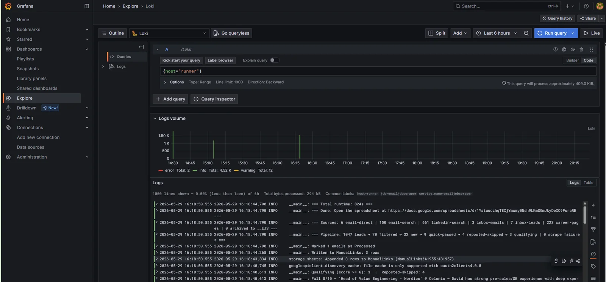

The five stacks deployed so far all live on the monitor VM, and the Alloy from the [last post]() is shipping logs from every container on that one host. There's a second machine in the lab whose logs I want in the same place: `runner`, the VM that hosts a set of Python job-scraping scripts under `/opt/eMailJobScraper/`. The scrapers write per-invocation log files like `scraper_20260528_165802.log`, and right now the only way to read any of it is `ssh runner` and `tail -f`. Same SSH-and-tail dance the central-logging story is meant to end, one host earlier than the planned roll-out.

This post takes a single step sideways from the build sequence to ship those logs into the existing Loki. Slightly out of order on purpose: doing it now is the cheapest end-to-end test that the central pipeline actually accepts pushes from a different box, and a non-Docker workload exercises a different Alloy shape (file tailing, native systemd, no compose) than the multi-host Docker roll-out queued up next.

<!--more-->

## Why this is out of sequence

The roadmap teased at the end of the [Loki/Alloy post]() had Alloy rolling out to the other Docker hosts in the lab (influx, dns, the Proxmox host itself), all running the same compose file with a one-line label change per host. That's still the right next step for the Docker-resident workloads, and it's the one I'll write up after this. But there are two things doing the non-Docker case first earns that doing it after wouldn't:

**It's a smoke test for the central architecture.** Until something outside the monitor VM successfully pushes to `https://loki.lab.davidmjudge.me.uk/loki/api/v1/push`, the public push endpoint is theoretical. The Traefik router exists, the cert is valid, the in-stack Alloy talks to Loki over the in-stack `monitoring` network and never touches the public URL. Anyone who's stood up enough of these will tell you the public endpoint is exactly the kind of thing that looks fine until the first external client tries to use it and finds out the certificate chain isn't trusted by the client's resolver, or the firewall rule was scoped wrong, or the push body limit is too low. Better to find that out from one well-understood agent now than to discover it during a roll-out to four hosts at once.

**It introduces the file-source pattern.** Every other Alloy in this homelab so far has used `loki.source.docker`, which only works when the producer is a Docker container observed via the daemon's API. Plenty of useful workloads run as systemd units, cron jobs, or scripts dropped under `/opt`, and Alloy reads those through `loki.source.file` instead. That's a different first hop in the pipeline (file globs and inotify rather than the Docker daemon HTTP API), a different ownership model (the agent's UID needs read access to log files on disk, not membership of the docker group), and a different deployment shape (native systemd rather than a compose service). Worth its own post rather than tucked inside a "roll-out to four hosts" entry where the file-source story would get half a paragraph.

## Alloy is the OpenTelemetry Collector with Grafana on top

Worth flagging this here because it's the load-bearing reason Alloy is the agent in this stack rather than Promtail, Vector, or Fluent Bit, and because it shows up explicitly in two posts' time.

Alloy is built on the OpenTelemetry Collector's component model and embeds the upstream `otelcol` receivers, processors, and exporters directly ([Alloy docs](https://grafana.com/docs/alloy/latest/), [Alloy reference: OTel compatibility](https://grafana.com/docs/alloy/latest/reference/compatibility/)). The Grafana-specific components (the `loki.*`, `prometheus.*`, and `mimir.*` families) sit alongside the OTel ones in the same runtime, sharing the same configuration language and the same component graph. That's a structural rather than aspirational claim: when this stack reaches the OTel-collector and Tempo steps later in the series, the receivers we need (`otelcol.receiver.otlp` over both HTTP and gRPC) and the exporters we'll point at Tempo (`otelcol.exporter.otlp`) are already present in the agent I'm installing today.

The practical consequence is convergence. The Alloy going onto runner right now is tailing files for Loki. The same binary, with one component added per signal, will accept OTLP traces from the eMailJobScraper if I instrument it with the Python OTel SDK ([OpenTelemetry overview](https://opentelemetry.io/), [Python SDK quickstart](https://opentelemetry.io/docs/languages/python/getting-started/)) and forward them to Tempo. No second agent on runner, no second supervisor, no second set of credentials to manage. Today this is a design constraint paying off: choosing Alloy over Promtail at step 4 was a bet that the homelab would want traces and metrics from non-Docker hosts later, and the dividend lands without any extra work on runner.

The reverse-direction claim is also true and occasionally useful: if a third-party agent emits OTLP and we want to receive it centrally, the monitor's Alloy can accept it ([`otelcol.receiver.otlp` reference](https://grafana.com/docs/alloy/latest/reference/components/otelcol/otelcol.receiver.otlp/)). That's not something I'm wiring today; it's a door the architecture leaves open.

## What changes from the monitor's Alloy

Three diffs from the [Alloy already running on monitor](). Everything else (the cardinality discipline on labels, the trust posture around no auth on the LAN, the configuration-as-code shape) carries straight across.

**A native systemd service from the apt repo.** Monitor runs Alloy in a compose service because everything else on monitor is already Docker, so the marginal cost of one more container was zero. Runner is a pure-application VM with no Docker daemon installed and no other containers, which means deploying Alloy as a container would mean installing Docker as a dependency of observability. That inverts the dependency direction: the agent that watches the host shouldn't drag a runtime onto the host that wasn't there before. The apt package gives a systemd-managed binary, a config dir at `/etc/alloy/`, a state dir at `/var/lib/alloy/`, log integration via journald, and `apt-get upgrade` for version bumps. Same operational surface every other systemd service on the host already presents.

**File tailing via `loki.source.file`.** The scrapers write actual files, and `loki.source.docker` only works when the producer is a container being observed through the daemon API. Tailing files is the right pattern for anything else. The pipeline shape stays the same (discover, source, relabel, write), only the first component changes: `local.file_match` turns the glob into a target list, `loki.source.file` does the tailing with inotify, and the rest of the chain is identical to monitor's.

**Push over the public TLS endpoint.** Monitor's Alloy talks to `http://loki:3100` because both containers share the `monitoring` Docker network. Runner has no such shortcut; it's a separate VM. The choice was between (a) opening Loki's port 3100 to the LAN with no TLS, or (b) using the Traefik-fronted endpoint that already exists on monitor. (b) is free: Traefik already terminates TLS via the Cloudflare cert resolver for `https://loki.lab.davidmjudge.me.uk`, and runner's resolver already trusts the Let's Encrypt chain. No extra config on monitor, no extra surface on runner.

## Folder layout
 
Per-host satellite agents live under `stack/04-loki/agents/<host>/`, one folder per VM that pushes to the central Loki:

```
stack/04-loki/agents/runner/
├── config.alloy       # loki.source.file -> loki.write to public Loki
└── README.md
```

No compose, no `.env`, no `data/`. Alloy is a systemd service installed from Grafana's apt repo; its state lives under `/var/lib/alloy/` on the host (package-managed, off the repo). The `stack/NN-*` numbering remains for the build-step axis; rolling Alloy to a new host is a different axis (per-host, not per-step), and keeping satellites under the stack they push to means the data flow is what's adjacent in the repo, which is what matters when you're debugging where a log line came from.

## The Alloy config

`stack/04-loki/agents/runner/config.alloy`:

```hcl
local.file_match "scraper" {
    path_targets = [{
        __path__ = "/opt/eMailJobScraper/logs/scraper_*.log",
        job      = "emailjobscraper",
    }]
}

loki.source.file "scraper" {
    targets    = local.file_match.scraper.targets
    forward_to = [loki.relabel.scraper.receiver]
}

loki.relabel "scraper" {
    forward_to = [loki.write.remote.receiver]
    rule {
        action = "labeldrop"
        regex  = "filename"
    }
}

loki.write "remote" {
    external_labels = { host = "runner" }
    endpoint {
        url = "https://loki.lab.davidmjudge.me.uk/loki/api/v1/push"
    }
}
```

Four components, same shape as the Docker pipeline on monitor.

**`local.file_match`** turns the glob into a list of targets. The non-`__`-prefixed keys on each target (here, `job`) become Loki labels on every line read from those paths. The discoverer rescans on a 10s default interval, so each new `scraper_YYYYMMDD_HHMMSS.log` written by a fresh scraper run gets picked up automatically without an Alloy reload. New file detection lags by up to ten seconds; once a file is open, new lines flow through inotify in sub-second time.

**`loki.source.file`** does the actual tailing. It opens each target, follows it with inotify, and emits one log entry per line. Its read position per file is persisted under `/var/lib/alloy/` so a restart doesn't re-ingest everything.

**`loki.relabel`** is the cardinality decision, and it's the most important block in the file. `loki.source.file` automatically attaches a `filename` label to each entry that names the file the line came from. For a workload that rotates by date (one file per scraper run, several per day, hundreds per month), keeping that label indexed would mint a new Loki series per invocation. Loki's index cost is paid per unique label combination, not per line, and a series count that scales with run-count instead of host-count is the textbook cardinality death the [Loki/Alloy post]() warned about. Dropping it via `action = "labeldrop"` keeps the indexed label set to exactly `{host, job}`, which is what the queries actually need. The filename itself is recoverable from inside each log line if anyone ever asks (the scrapers print the run identifier at startup), or could be promoted to structured metadata in a follow-up edit; neither of those pays the indexed cost.

**`loki.write`** points at the public endpoint. `external_labels = { host = "runner" }` attaches the `host` label to every line out of this agent, which is the one per-host change that gets made when this config rolls to a second satellite. No auth on this endpoint today, same trust call the monitor stack made for the LAN; if/when the trust boundary widens, the upgrade is a `basicAuth` middleware on Traefik plus a `basic_auth { }` block inside this endpoint, both one-time edits.

## Bringing it up

From the workstation, push the per-host config to runner:

```bash
ssh runner 'mkdir -p ~/alloy'
rsync -av stack/04-loki/agents/runner/ runner:~/alloy/
ssh runner
cd ~/alloy
```

On runner, add Grafana's apt repo and install Alloy. Grafana sign their packages with a single GPG key for the whole apt repo, so this is the same install pattern that would also bring in Grafana itself, Mimir, or Tempo if any of them needed to land on this host later:

```bash
sudo mkdir -p /etc/apt/keyrings
wget -q -O - https://apt.grafana.com/gpg.key | \
    sudo gpg --dearmor -o /etc/apt/keyrings/grafana.gpg
echo "deb [signed-by=/etc/apt/keyrings/grafana.gpg] https://apt.grafana.com stable main" | \
    sudo tee /etc/apt/sources.list.d/grafana.list
sudo apt-get update
sudo apt-get install -y alloy
```

The package creates an `alloy` user, drops a systemd unit at `/usr/lib/systemd/system/alloy.service`, and writes a stub config to `/etc/alloy/config.alloy`. The unit runs `/usr/bin/alloy run --storage.path=/var/lib/alloy/data /etc/alloy/config.alloy` as the `alloy` user, so the first real piece of work is making sure that user can actually read the scraper logs.

This is where I tripped, and the trip is worth a section of its own.

## The directory traversal trap

The scraper logs are mode `664` (`-rw-rw-r--`), which is already group+world readable. The log directory was `700`:

```
$ ls -ln /opt/eMailJobScraper/logs/ | head -3
-rw-rw-r-- 1 1000 1000 155992 May 21 13:00 scraper_20260520_131303.log
-rw-rw-r-- 1 1000 1000  14304 May 21 13:00 scraper_20260520_143102.log
-rw-rw-r-- 1 1000 1000  67344 May 21 13:00 scraper_20260520_150634.log
$ stat -c '%U %G %a' /opt/eMailJobScraper/logs/
david david 700
```

The instinct (and what I documented in the first cut of this stack's README) was a single `sudo chmod o+rx /opt/eMailJobScraper/logs`. The directory is the gate; open the gate, alloy can read the files. Deployed, Alloy started, `systemctl status` reported `active (running)` with no errors in the journal, and `lsof -p $(pgrep alloy)` showed no scraper files open. Twenty seconds later, still nothing. Component graph green, no permission errors, no logs flowing.

The miss was the *parent* directory. `/opt/eMailJobScraper/` itself was also `700`, and a process needs `o+x` (the traverse bit) on every directory segment on the path to a file, not just the immediate parent. With `/opt/eMailJobScraper` at `700`, the `alloy` user couldn't enter the directory at all, so the `chmod` on the leaf was invisible: Alloy couldn't even reach the inner directory to discover that it had read access on the files inside.

The failure mode is the cruel part. There's no journal line, no warning, no error in the component graph. `local.file_match` runs its glob via the standard library, the standard library returns an empty list because traversal failed silently, and Alloy goes about its business with zero targets to tail. From the outside it looks like everything's working; the agent is just convinced there's nothing to follow.

The fix is two `chmod`s and one verification:

```bash
sudo chmod o+x  /opt/eMailJobScraper
sudo chmod o+rx /opt/eMailJobScraper/logs

# Read a real file as the alloy user. If this succeeds, the whole path
# is traversable; if it fails, `namei -l` will name the segment that's
# still blocking.
sudo -u alloy cat /opt/eMailJobScraper/logs/scraper_*.log | head -1
```

That last command is the one that costs five seconds and would have saved the diagnosis loop. Running as the agent's own user is the only definitive check. Anything `david` can read (because they own the tree), anything `root` can read (because root bypasses traversal), neither tells you anything useful about whether the agent can read. The `sudo -u alloy cat` is what the agent's first poll does internally; if a human can do it, the agent can.

That's now the documented step in `stack/04-loki/agents/runner/README.md` and it'll be the documented step for every future satellite agent that reads files on a non-Docker host. Easier to write the verification line than to debug the silence.

## Deploying the config and starting the service

With the perms confirmed:

```bash
sudo cp config.alloy /etc/alloy/config.alloy
sudo systemctl enable --now alloy
sudo systemctl restart alloy
sudo systemctl status alloy --no-pager
```

The `enable --now` symlinks the unit into multi-user.target and starts the service in one call; the `restart` after it is belt-and-braces in case the package already auto-started Alloy with the stub config before the new one was in place.

The status output should report `active (running)` and the recent journal entries should mention component evaluation succeeding for `local.file_match.scraper`, `loki.source.file.scraper`, `loki.relabel.scraper`, and `loki.write.remote`.

## Verification

Three layers, in increasing definitiveness.

**Alloy has the files open.** `lsof` against the running process is the unambiguous answer:

```bash
sudo lsof -p "$(pgrep -x alloy)" | grep scraper
```

One line per `scraper_*.log` file, mode `r` (reading). If this is empty, the discoverer found nothing; fall back to the traversal check above.

**The positions file is moving.** Alloy persists the byte offset per tailed file. Two snapshots a few seconds apart with the live scraper running show the offset increasing for the current file:

```bash
sudo find /var/lib/alloy -name 'positions.yml' -exec cat {} \;
```

**Lines from this run actually landed in Loki.** Most definitive of all. On runner, grab a distinctive substring from a currently-running scraper:

```bash
sudo tail -n 3 /opt/eMailJobScraper/logs/scraper_*.log | tail -1
```

Then in Grafana, **Explore** -> **Loki** -> **Code**, run:

```logql
{host="runner"} |= "<substring from above>"
```

The line should return within ~1-3 seconds of being written: sub-second from inotify, up to ~1s from `loki.write`'s default 1s batch wait, a few hundred ms through the ingester. (Brand-new files lag up to ~10s through the 10s `local.file_match` rescan; once a file is open, subsequent lines are sub-second.)



Grafana's Explore view doesn't auto-refresh; toggle **Live** at the top right to stream new lines as they land, otherwise re-run the query manually.

## What I deliberately didn't ship

**Multiline stitching for Python tracebacks.** A traceback spans many lines and would ideally arrive in Loki as a single entry per traceback rather than one entry per line. Alloy supports this with `loki.process` and a `stage.multiline` block, but the regex depends on the exact prefix shape of the scraper's log lines, and guessing it before seeing real tracebacks in Grafana tends to produce a regex that mis-splits real traces. V1 ships one-line-per-entry; the multiline stage gets added in a follow-up edit once a real traceback is visible in Explore and the prefix is unambiguous.

**Auth on the push endpoint.** Same call the [monitor stack]() made: runner is on the LAN, runner pushes to a LAN-only DNS name that resolves to a LAN-only IP, the trust posture is no worse than the monitor's own in-stack call to `http://loki:3100`. When the trust boundary widens (a VPS shipping logs in, a contractor on the LAN), the upgrade is a basicAuth middleware on Traefik plus a `basic_auth { }` block inside `loki.write.remote`, both one-time edits. Doing the basicAuth dance today buys nothing the trust model doesn't already give for free.

**A `filename` label promoted to structured metadata.** Loki 3 supports per-line structured metadata that's not indexed but is queryable as a field. There's a case for surfacing the source filename that way so individual scraper runs can be filtered without paying the indexed-cardinality cost. Holding that until a real query actually wants it; speculative metadata is the same cost as a speculative label, just paid in storage rather than index.

## Where we are

Six steps in, plus a satellite: the same five from [last post]() running on the monitor VM, with a native-systemd Alloy on runner pushing the eMailJobScraper logs into the central Loki over the Traefik-fronted public endpoint.

## What's next

Back on the planned arc: Alloy rolls to the other Docker hosts in the lab (`dock` and `docker04`), running the same compose as monitor's with the one-line `host` label change per host. By the end of that post, `{host=~".+"}` in Grafana returns logs from every running container across the Docker estate, the log-volume chart splits traffic by host, and "ssh to whichever box might have it" stops being part of how I read logs.
