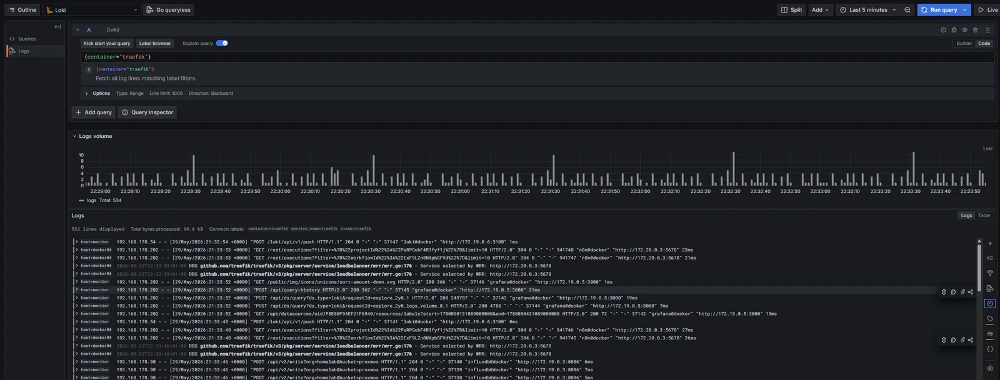
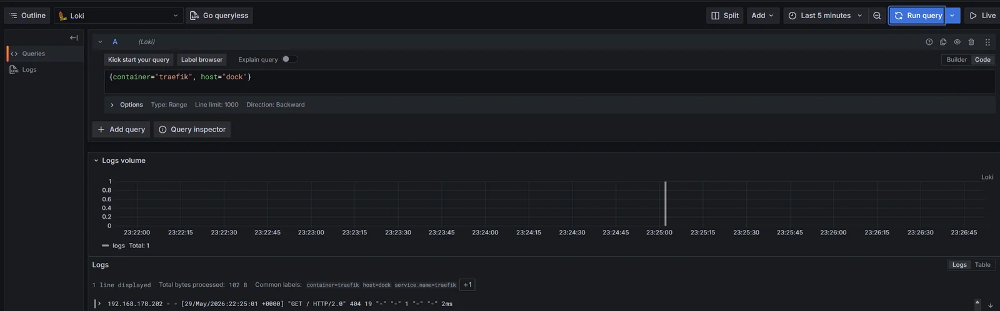
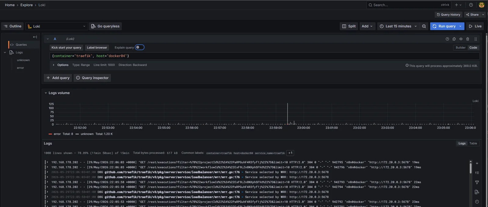

The Loki on monitor has been collecting logs from exactly one Docker host since it landed: monitor itself. The two satellite Docker hosts in the lab, `dock` and `docker04`, are still on the "ssh in and `docker logs`" workflow that the central-logging story is meant to retire. There are also containers running across all three hosts with overlapping or identical names. Some of those are duplicate containers I'll be decommissioning as this build-out lands, but several are real workloads I want to be able to differentiate cleanly in Grafana ("Traefik on monitor" vs. "Traefik on dock") rather than mash them together into a single stream.

This post rolls Alloy onto both Docker hosts using a single template, parameterised by one environment variable so the per-host change is one line of `.env` and the config file itself is byte-identical across hosts. By the end, `{host=~".+"}` in Loki returns containers from all three Docker hosts plus the runner satellite from [last post](), and the `host` label is the primary axis for any query that wants to focus on one instance.

<!--more-->

## The stack so far


flowchart LR
    PX["Proxmox"]
    Client["LAN clients"]
    subgraph runner["runner"]
        RA["Alloy"]
    end
    subgraph dock["dock"]
        DA["Alloy<br/>(Docker)"]:::new
    end
    subgraph docker04["docker04"]
        D4A["Alloy<br/>(Docker)"]:::new
    end
    subgraph monitor["Monitor VM"]
        TR["Traefik"]
        IDB[("InfluxDB")]
        PR[("Prometheus")]
        LK[("Loki")]
        AL["Alloy"]
        GF["Grafana"]
    end
    PX -->|HTTPS| TR
    Client -->|HTTPS UI| TR
    RA -->|HTTPS push| TR
    DA -->|HTTPS push| TR
    D4A -->|HTTPS push| TR
    TR --> LK
    PR -.->|scrape| TR
    AL -.->|push logs| LK
    GF -.->|query| IDB
    GF -.->|query| PR
    GF -.->|query| LK
    classDef new stroke:#2e7d32,stroke-width:3px,fill:#c8e6c9;


Two more Alloys land on `dock` and `docker04`, sharing the same Docker template. The `host` label disambiguates same-named containers across all four agents writing to Loki now.

## What changes from monitor's Alloy

The monitor stack runs Alloy alongside Loki in the same compose project, with both fronted by Traefik. The satellite case strips that down. Three deliberate differences:

**No Loki in the satellite compose.** Loki lives on monitor; the whole point of central logging is that there's one of it. Each satellite is an Alloy-only deployment that pushes over the network. The compose drops from two services to one.

**No Traefik labels on the satellites.** Monitor's Alloy got a public URL at `https://alloy.lab.davidmjudge.me.uk` because the debug UI was useful while standing the stack up, and adding one more router to monitor's Traefik is five labels in `compose.yaml` plus a fresh TLS cert that Traefik issues itself. The satellites could be exposed the same way (both `dock` and `docker04` run Traefik themselves), but every additional public URL is another CNAME to keep alive in Bind, another TLS cert to renew, and another unauthenticated component-graph UI sitting on the LAN. For a UI an operator dips into when something's broken, the cost-benefit doesn't pencil out. The satellites bind Alloy's HTTP listener to the host's loopback only and use the same SSH-tunnel one-liner the runner satellite already documented; one debugging pattern for every future satellite, no per-host DNS, cert, or router work.

**Configuration parameterised by `HOST_LABEL`.** The one per-host change that actually matters is the value of the `host` Loki label. Monitor's config hard-codes `labels = { host = "monitor" }`. The satellite reads the value from an environment variable via `sys.env("HOST_LABEL")` so the same `config.alloy` works on every Docker host and the per-host knob lives entirely in `.env`. Adding a third Docker host later is `rsync` the folder, edit one line of `.env`, `docker compose up -d`.

## The template

One folder under `agents/`, byte-identical across hosts:

```
stack/04-loki/agents/docker-host/
├── compose.yaml       # alloy only, no Traefik, UI on loopback
├── config.alloy       # docker socket -> Loki write over TLS
├── .env.example       # DOCKER_GID and HOST_LABEL
└── README.md
```

The compose is a slimmed version of monitor's:

```yaml
services:
  alloy:
    image: grafana/alloy:v1.5.1
    container_name: alloy
    hostname: alloy.${HOST_LABEL}
    restart: unless-stopped
    user: "10001:${DOCKER_GID}"
    environment:
      - TZ=Europe/London
      - HOME=/alloy-data
      - HOST_LABEL=${HOST_LABEL}
    command:
      - "run"
      - "--server.http.listen-addr=0.0.0.0:12345"
      - "--storage.path=/alloy-data"
      - "/etc/alloy/config.alloy"
    volumes:
      - ./data/alloy:/alloy-data
      - ./config.alloy:/etc/alloy/config.alloy:ro
      - /var/run/docker.sock:/var/run/docker.sock:ro
    ports:
      - "127.0.0.1:12345:12345"
```

Everything that earned a section of its own in [the Loki/Alloy post]() carries straight across: non-root UID with the host's `docker` group as primary GID, `HOME=/alloy-data` so `remotecfg` doesn't trip over the image's root-owned `/var/lib/alloy/` parent, `/var/lib/docker/containers/` deliberately not mounted because `loki.source.docker` uses the daemon API rather than tailing on-disk files. The compose is shorter only because the things that didn't apply (Traefik labels, Loki service, the shared `monitoring` network) are gone.

The config is the same shape as monitor's, with one substitution and one extra processing stage that earns its own section below:

```hcl
loki.source.docker "containers" {
    host       = "unix:///var/run/docker.sock"
    targets    = discovery.relabel.containers.output
    labels     = { host = sys.env("HOST_LABEL") }
    forward_to = [loki.process.drop_old.receiver]
}

loki.process "drop_old" {
    forward_to = [loki.write.remote.receiver]
    stage.drop {
        older_than          = "24h"
        drop_counter_reason = "too_old"
    }
}

loki.write "remote" {
    endpoint {
        url = "https://loki.lab.davidmjudge.me.uk/loki/api/v1/push"
    }
}
```

`sys.env("HOST_LABEL")` is Alloy's stdlib accessor for environment variables, resolved at config-load time. The value is whatever the compose passed in from `.env`; the file itself never needs editing per host. The `loki.write` endpoint is the public Traefik-fronted URL on monitor, identical to the runner agent's push target. Same trust posture, same TLS termination, no auth on the LAN.

The `loki.process.drop_old` stage between source and write isn't decorative; it's there because the first dock deploy without it failed in an interesting way. Detail in its own section after the bring-up.

## Bringing it up on dock

From the workstation:

```bash
ssh dock 'mkdir -p ~/alloy'
rsync -av --exclude='.env' --exclude='data/' \
    stack/04-loki/agents/docker-host/ dock:~/alloy/
ssh dock
cd ~/alloy
```

On dock, generate `.env` from the template with both values looked up live. `getent group docker | cut -d: -f3` returns whatever the host's `docker` group GID is (Debian-family installs commonly assign 998 or 999, but the value drifts and a wrong value here is exactly the kind of silent failure the monitor post called out). `hostname -s` returns the short hostname, which is the convention we want for the `host` label:

```bash
sed -e "s/^DOCKER_GID=.*/DOCKER_GID=$(getent group docker | cut -d: -f3)/" \
    -e "s/^HOST_LABEL=.*/HOST_LABEL=$(hostname -s)/" \
    .env.example > .env

cat .env
# DOCKER_GID=998
# HOST_LABEL=dock
```

Pre-create and chown the data dir to match the UID and GID Alloy will run as:

```bash
mkdir -p data/alloy
sudo chown -R 10001:$(getent group docker | cut -d: -f3) data/alloy

docker compose up -d
docker compose logs alloy --tail 30
```

The journal should mention `discovery.docker.containers` finding the host's containers (a count proportional to whatever was already running on dock), the relabel rules evaluating, and `loki.write.remote` connecting to `loki.lab.davidmjudge.me.uk`. No `permission denied` lines anywhere.

## Bringing it up on docker04

Same exact commands. The `sed` substitution pulls the right value from `getent` and `hostname -s` on each host, so the only delta in the deployed `.env` between dock and docker04 is the line we want it to be different:

```bash
ssh docker04 'mkdir -p ~/alloy'
rsync -av --exclude='.env' --exclude='data/' \
    stack/04-loki/agents/docker-host/ docker04:~/alloy/
ssh docker04
cd ~/alloy

sed -e "s/^DOCKER_GID=.*/DOCKER_GID=$(getent group docker | cut -d: -f3)/" \
    -e "s/^HOST_LABEL=.*/HOST_LABEL=$(hostname -s)/" \
    .env.example > .env

cat .env
# DOCKER_GID=999     # different on this host as it happens
# HOST_LABEL=docker04

mkdir -p data/alloy
sudo chown -R 10001:$(getent group docker | cut -d: -f3) data/alloy

docker compose up -d
```

Belt-and-braces sanity check that Loki now knows about both hosts. From any workstation:

```bash
curl -s https://loki.lab.davidmjudge.me.uk/loki/api/v1/label/host/values | jq
# [
#   "dock",
#   "docker04",
#   "monitor",
#   "runner"
# ]
```

Four values: the three Docker hosts and the runner satellite. That's the first proof point that Loki has accepted at least one log line from each agent and the `host` label is now populated with the right values.

## The first-contact backfill problem

This is the section the `loki.process.drop_old` stage in the template earns. First time I deployed to dock without it, `docker compose logs alloy` opened with a wall of HTTP 400s:

```
alloy | level=error msg="final error sending batch" component=loki.write.remote
  status=400 error="server returned HTTP status 400 Bad Request (400):
  9 errors like: entry for stream
  '{container=\"portainer\", host=\"dock\", service_name=\"portainer\"}'
  has timestamp too old: 2025-06-02T16:14:42Z,
  oldest acceptable timestamp is: 2026-05-22T18:18:05+01:00;
  11 errors like: entry for stream '{container=\"portainer\", ...}'
  has timestamp too old: 2025-11-14T10:36:24Z, ...
  3 errors like: ... has timestamp too old: 2025-05-01T10:32:44Z, ..."
```

Three things in there worth unpacking. First, the rejected timestamps span from `2025-05-01` to `2025-11-14`. That's almost a year of historical log entries from a Portainer container that's been running on dock without a restart for ages. Second, the "oldest acceptable timestamp" is exactly seven days before now (`2026-05-22T18:18:05+01:00` against `2026-05-29` deploy time). Seven days is Loki's default `reject_old_samples_max_age` (168 hours); anything outside that window is refused. Third, the agent is *trying* to ship all of it, not just current content.

The cause is in how `loki.source.docker` handles first contact with a container. On a freshly deployed Alloy with no positions file, the component asks the Docker daemon for each container's logs via `GET /containers/{id}/logs?follow=1&stdout=1&stderr=1`. With no `since` parameter, the daemon hands back the *full* in-memory log buffer for that container: every line it's holding, however far back that goes. For long-running containers, that's a lot of lines with timestamps well outside Loki's accept window.

The fix is to drop entries older than a safe threshold before they hit the wire. Adding a `loki.process` stage with a `stage.drop { older_than = "24h" }` rule between `loki.source.docker` and `loki.write` does exactly that:

```hcl
loki.process "drop_old" {
    forward_to = [loki.write.remote.receiver]
    stage.drop {
        older_than          = "24h"
        drop_counter_reason = "too_old"
    }
}
```

The 24-hour window is deliberately tighter than Loki's 7-day reject window. Three reasons. It leaves clock-skew margin between the Docker host and the Loki host. It saves bandwidth on any future Alloy restart that loses its positions file (otherwise the agent would re-ship anything between the last position and `now - 7d`). And it makes the contract explicit: this agent ships current logs, not historical ones, and the threshold doesn't change if Loki's reject window changes.

The honest trade is losing each container's pre-agent log buffer. For Portainer on dock, that's a year of lines that nobody was reading; for a fresh container started just before Alloy came up, there's nothing older than 24 hours to drop and the trade costs nothing. The case where this matters is somewhere in between: a container restarted hours before Alloy joined, with that startup-period content held in the buffer. If a future deploy needs that one-off backfill, raise the threshold for one boot, deploy, then put it back to 24h.

Without the `drop_old` stage, the failure mode looks worse than it is. Loki accepts the valid entries in the same push and only rejects the too-old ones, but it returns HTTP 400 with a list of individual rejections. Alloy treats the 400 as a full failure and retries the batch, hitting the same rejections again, in a loop that fills the logs with noise. Current entries do land in Loki despite the 400s, so a `{host="dock"}` query in Grafana Explore over the last five minutes does return data even before the fix; the symptom is alarming-looking error logs, not actual data loss. But the wire chatter is unnecessary and the agent's retry behaviour against rejected entries makes the dashboards on dock's containers slow to populate. Worth catching at first deploy.

The same stage is now in monitor's [`alloy-config.alloy`]() for symmetry; the issue there was masked only because monitor's containers were brand new when its Alloy started and there was no historical buffer to ship.

## Querying by host

With three Docker agents pushing the same set of indexed labels (`container`, `stream`, `stack`, `host`), the `host` label is what turns "Traefik logs" into an addressable query rather than a soup.

The unfiltered view (every Traefik on every host) is the soup:

```logql
{container="traefik"}
```

Logs from three Traefiks interleave in chronological order. Each line shows its `host` chip on the left, so the visual cue is there, but the volume chart is just one bar per time bucket and there's no way to tell at a glance which host is busier.



Adding `host="dock"` collapses it to one instance:

```logql
{container="traefik", host="dock"}
```

Now the panel is just dock's Traefik. The same query with `host="docker04"` returns only docker04's, and `host="monitor"` only monitor's. This is the test that the architecture is doing what it was designed to do: same container name, three independent streams, one extra label flipping between them.


Note that there's very little activity on `dock` - I'm slowly migrating those stacks to another VM.




The query that actually exposes the per-host split visually is the `sum by (host)` aggregation:

```logql
sum by (host) (count_over_time({container="traefik"} [5m]))
```

`count_over_time` turns the log stream into a numeric time series (lines per 5-minute window); `sum by (host)` groups those counts by the host label. The result is three separate series in the volume chart, colour-coded by host, plotted in the same panel. That's the "which Traefik is the loudest right now" view, and it lives on the time-series side of LogQL rather than the log-stream side.

![Grafana Explore running sum by (host) (count_over_time({container="traefik"} [5m])): three coloured lines in the time-series panel, one per host, showing each Traefik's log line rate over the last 5 minutes; legend identifies host=monitor, host=dock, host=docker04.](images/04-loki-traefik-by-host-rate.webp)

The same shape of query works for any per-host comparison: log volume per service, error rates per host, restart counts split by stack. The `host` label is the join axis the whole observability story rests on.

## A note on container-name collisions

A complication that's worth flagging because it'll show up the first time anyone runs `{container="<some-name>"}` across all hosts: some containers have similar or identical names across the three Docker hosts as a consequence of the lab's history rather than its current intent. There are duplicate `portainer` containers from before consolidation happened, a couple of test deployments that shadow service names that exist elsewhere, and at least one container whose name doesn't reflect what it currently runs because it was repurposed without a rename.

The pragmatic answer for now is that the `host` label is doing exactly the disambiguation it's designed to do. `{container="portainer", host="dock"}` and `{container="portainer", host="docker04"}` are two unambiguous queries against two unambiguous streams, even if the bare `{container="portainer"}` returns a mashup. The mashup isn't wrong; it's accurately reflecting what's deployed.

The longer-term answer is that the homelab roll-out itself prunes this. As each stack lands properly (one canonical Traefik, one canonical Portainer, the right service on the right host), the historical duplicates get decommissioned in the same change. The `host` label is the bridge that keeps queries useful through that transition; without it, "is the new central Portainer running yet?" wouldn't have a query I could write today, because the answer would depend on which of the three hosts I happened to be looking at.

Worth being explicit about this in the post rather than letting it become a puzzle for anyone reading along, because the "wait, why are there two of those?" question is going to show up the first time someone clicks into a query result and sees a container they thought was gone.

## Debugging a satellite Alloy

The component graph at `:12345` is the same diagnostic UI as monitor's, but the listener is bound to the satellite host's loopback only (`127.0.0.1:12345`), which keeps it off the LAN. From a workstation:

```bash
ssh -L 12345:localhost:12345 dock
# then open http://localhost:12345 in a browser
```

The graph view shows `discovery.docker.containers` -> `discovery.relabel.containers` -> `loki.source.docker.containers` -> `loki.write.remote`, all green if the pipeline is healthy. The `loki.write.remote` node is the one most likely to go red on a satellite, because it's the one whose endpoint depends on the public Traefik on monitor being reachable from this host. A red `loki.write` here, before suspecting anything else, run from the satellite:

```bash
curl -sI https://loki.lab.davidmjudge.me.uk/ready
# HTTP/2 200
```

If that's not 200, the satellite can't reach the central endpoint and no Alloy debugging will help. Usual suspects: the satellite's resolver hasn't picked up the Cloudflare DNS for `loki.lab.davidmjudge.me.uk` yet, or a firewall rule between the two hosts is wrong. Solve that first.

## What this gets us

Three Docker hosts plus one non-Docker host pushing to one central Loki. Every container's stdout/stderr is queryable from one URL, addressable by host, with the same label vocabulary across all four agents. Adding the next Docker host to the lab is one command, one `.env` edit, one `docker compose up -d`; the existing dashboards and queries will pick it up the moment the new `host` value appears in the label index.

The architecturally interesting consequence is that "ssh in to look at logs" is now genuinely a fallback rather than a workflow. The Grafana Explore tab is the first place to go for any "what's the service doing right now" question, regardless of which host the service happens to be running on. That's the payoff the whole central-logging story was working towards.

## Where we are

Loki on monitor now has four agents pushing to it: monitor's own in-stack Alloy, the runner satellite from [last post](), and the new Alloys on dock and docker04 sharing the same template.

## What's next

The OpenTelemetry Collector. So far the agent picture is "one Alloy per host, all pushing logs"; the next post is what happens when an application starts emitting OTLP traces and metrics. The Collector becomes a central ingest plane that fans those out: metrics to Prometheus, logs to Loki, traces to whatever store lands next. That's the architectural pivot from "tactical observability of containers" to "instrumented applications", and it's where the OTel-compatibility lineage [flagged in the runner post]() starts paying off in concrete components rather than design intent.
