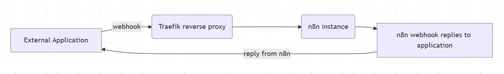
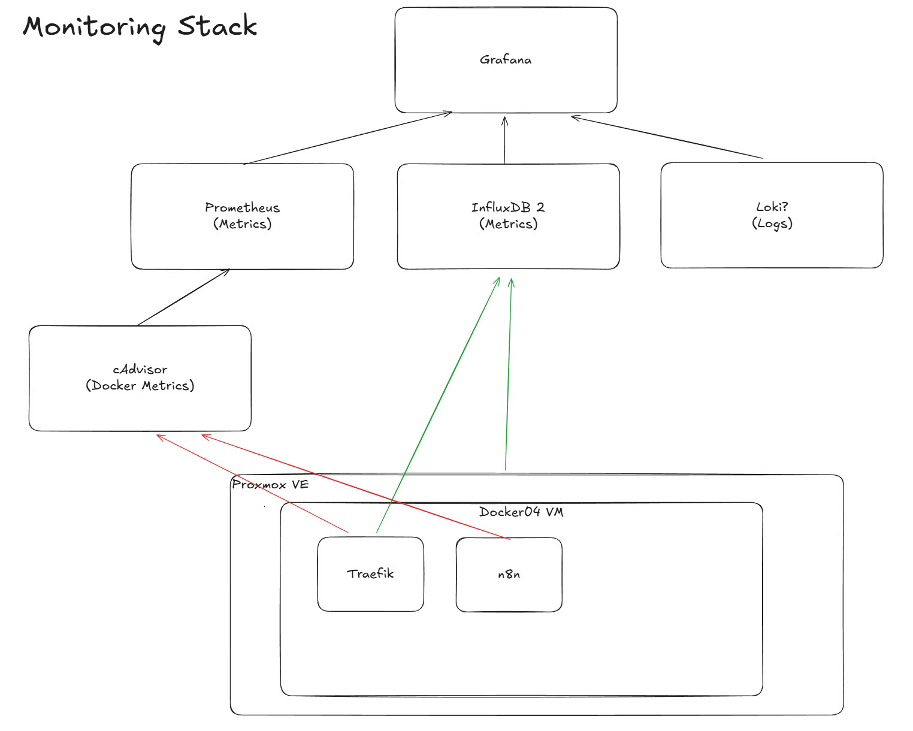
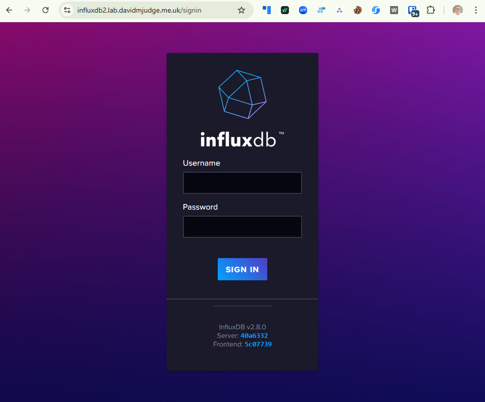
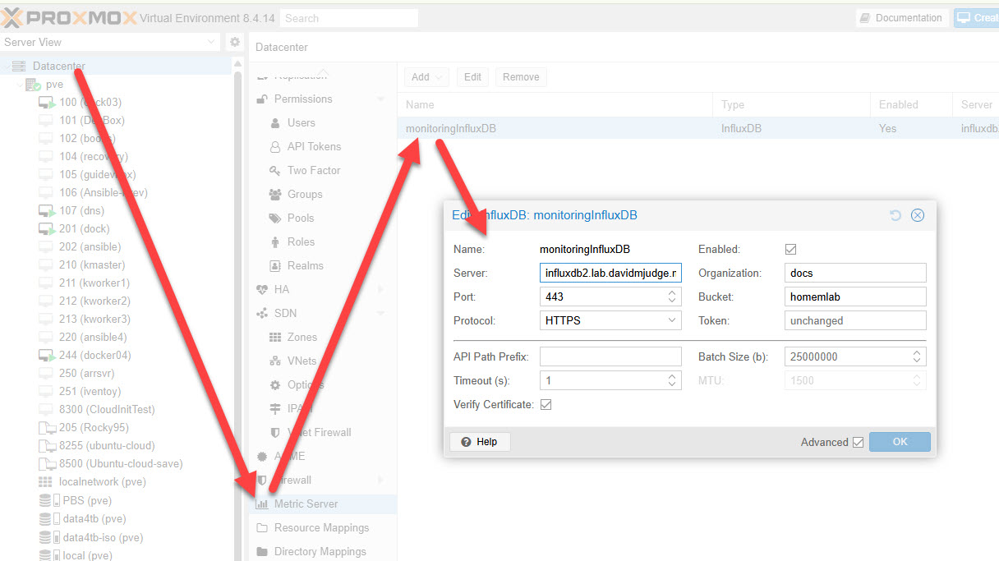

 I recently had an issue - while building and testing my [AI Voice Receptionist]( ) - when my traefik + n8n stack did not respond in a timely manner causing the voice conversation to pause for multiple seconds which, for a voice conversation, is not acceptable.

 At the time of writing, I was unable to determine the cause of the slow down.  Increasing the memory allocated to the VM that holds my stack made the problem go away, but not understanding how that fixed the problem is something I'm not happy with.

<!--more-->
Initially, this article will be something of a stream of consciousness as I think through he best approach.

In an ideal world, I'd love to just throw Datadog at the problem, but the costs of doing so are not realistic for my purposes as I estimate that everything I would like to implement for my home lab would cost around USD 60 per month.

There are some fantastic open-source tools that can be relatively easily bolted together to produce something I would be happy with.  However, at some point I will need to make choices.  I will update this article if what I end up implementing is different from what I'd written.

## My "stack"
My stack is:
- Traefik to provide SSL certs and to reverse-proxy n8n
- n8n to process requests

Traefik receives the requests sent to n8n.lab.davidmjudge.me.uk and sends them to the correct docker container.  That's the gist of what a reverse proxy does.  Another common proxy is Nginx Proxy Manager.  I chose Traefik as it is mostly configured using "labels" in the docker compose file for n8n (i.e. "Configuration as code") whereas Nginx requires configuration via a GUI.

For traefik to do its receive the https request for n8n, my DNS must map n8n.lab.davidmjudge.me to the docker VM (called docker04).  I have a  container running on a separate host to provide the DNS service.  For each service that runs in my environment I have an entry.  Below are examples of how n8n and traefik-dashboard are mapped to docker04.lab.davidmjudge.me.uk: 
``` bind
; CNAMES - Docker04
traefik-dashboard	IN	CNAME	docker04.lab.davidmjudge.me.uk.
n8n			        IN	CNAME	docker04.lab.davidmjudge.me.uk.
```
### Transactions in the stack
Here is what my transactions look like, from the calling application (VAPI, for example) all the way through n8n and its response:



There are various "things" from which I'd like to collect logs and metrics.
1. The proxmox server ("PVE") which runs my home lab and the VM that holds these containers
2. The containers themselves
3. The logs and metrics from Traefik
4. Logs and metrics from the n8n container

I'm not yet sure how I will implement the monitoring.  What I do know is that PVE knows how to send metrics to an influxDB - a specialised database for storing "time series data" (i.e. data tagged with timestamps).  And many tools used in Observability know how to use data coming from InfluxDB so it seems like a natural first step.

My initial thoughts were to go for the low-hanging fruits of Proxmox and traefik monitoring as they both know how to send metrics to InfluDB natively.  And cAdvisor for container monitoring sending its data to Prometheus.  And finally Grafana for displaying dashboards thus:



Red lines show the metrics, mainly collected by cAdvisor, while the green ones which are metrics pushed by the component itself (i.e.PVE and Traeffic).

As you can see from the diagram, I have not yet decided on how to collect logs.  I will either update the diagram or add a new one as my thoughts firm up.

I suspect that eventually I will put all the compose files into a single one, but for the time being, I will create individual ones for each "service".

### InfluxDB
#### Container Creation
I used an example container configuration and adapted it to my context and preferences, including setting the variables for traefik to reverse-proxy influxDB:

```yaml
services:
  influxdb2:
    container_name: influxdb2
    image: influxdb:2
    restart: unless-stopped
    # We remove 'ports' because Traefik handles external access. 
    # Add them back only if you need direct IP:8086 access.
    # ports:
    #   - 8086:8086 
    environment:
      - DOCKER_INFLUXDB_INIT_MODE=setup
      - DOCKER_INFLUXDB_INIT_USERNAME_FILE=/run/secrets/influxdb2-admin-username
      - DOCKER_INFLUXDB_INIT_PASSWORD_FILE=/run/secrets/influxdb2-admin-password
      - DOCKER_INFLUXDB_INIT_ADMIN_TOKEN_FILE=/run/secrets/influxdb2-admin-token
      - DOCKER_INFLUXDB_INIT_ORG=docs
      - DOCKER_INFLUXDB_INIT_BUCKET=home
    secrets:
      - influxdb2-admin-username
      - influxdb2-admin-password
      - influxdb2-admin-token
    volumes:
      - ./data:/var/lib/influxdb2
      - ./config:/etc/influxdb2
    networks:
      - proxy
    labels:
      - "traefik.enable=true"
      - "traefik.http.routers.influxdb.rule=Host(`influxdb2.lab.davidmjudge.me.uk`)"
      - "traefik.http.routers.influxdb.entrypoints=websecure"
      - "traefik.http.routers.influxdb.tls.certresolver=cloudflare" # Matches your CF_DNS_API_TOKEN setup
      - "traefik.http.services.influxdb.loadbalancer.server.port=8086"

secrets:
  influxdb2-admin-username:
    file: .env.influxdb2-admin-username
  influxdb2-admin-password:
    file: .env.influxdb2-admin-password
  influxdb2-admin-token:
    file: .env.influxdb2-admin-token

networks:
  proxy:
    external: true
```

I spun up the container from within VS Code and pointed my browser at https://influxdb2.lab.davidmjudge.me.uk and got the login screen:



### Sending some data to InfluxDB
As Proxmox VE knows, intrinsically, how to send data to InfluxDB, let's start by configuring that.

First, within InfluxDB's UI I created a new "bucket" called homelab.

I then created a configuration for the "Metrics" configuration of PVE:



Note that the influxDB organisation "docs" comes out of the box.


I like the Christian Lempa video on Alloy:  https://www.youtube.com/watch?v=E654LPrkCjo