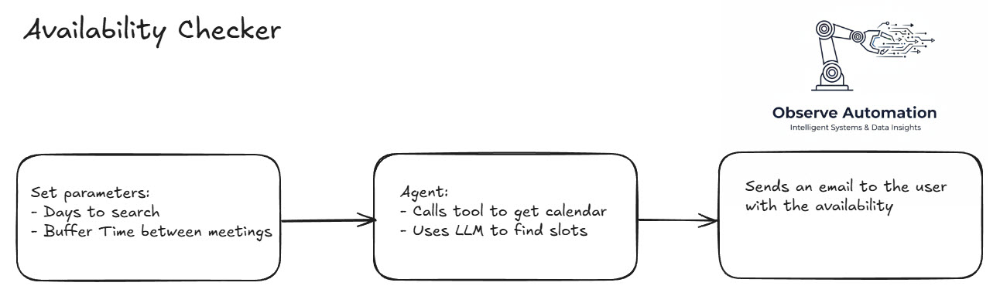
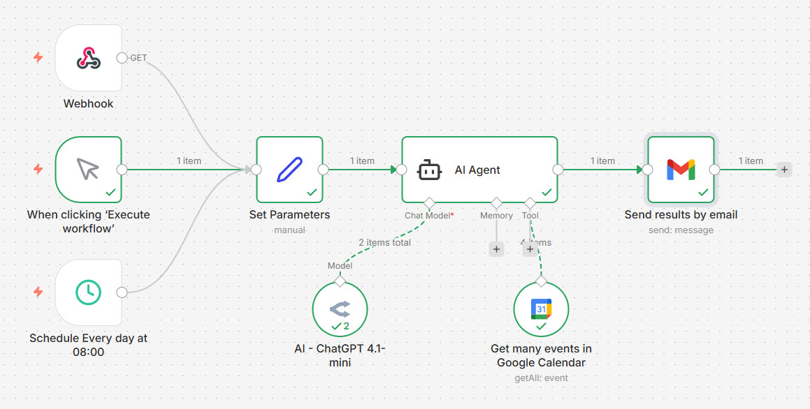

Finding slots for a meeting can, depending on the week, be challenging.

This workflow pulls calendar entries from Google Calendar and determines what slots are available.
<!--more-->
While this could be written as a simple workflow, it would need some code to work and I'm always striving to write no- or no-code, so the automation is agentic (i.e. autonomous).

At a high-level, this is the workflow:<br>


The workflow runs automatically at 8am every morning.  It starts by setting the parameters of the search for availability - i.e. next 5 days, leave 30 minutes between events.

I use AI to find my availability while leaving me the 30 minutes buffer before and after existing meetings.

The last stage is to send me an email with the availability.  

Just in case I know my diary has changed a fair bit, I include in the email a link to trigger the workflow manually which triggers a fresh email.

While this automation does not save much time - probably only 3-4 minutes per time I need to find a slot, the fact it runs automatically every day at 8am means I don't have to go look for the information and the risk of picking an incorrect slot (or a typo) is greatly reduced.

For the more technically-minded, here's the flow from n8n:<br>


The prompt for the AI is really quite simple:
```
You are my smart scheduling assistant.
Read my calendar for today and the next {{ $json.Days }} business days, starting from today.  Today is {{ $now.format('yyyy-MM-dd') }}
List all available time slots where I have at least {{ $json.buffer }} minutes of free time between events.

Display the results in a clean table with these columns:

Date and day of the week

Start Time (local time)

End Time (local time)

Include only working hours (09:00–18:00).
```

In the above json.Days is replaced with the number of days to search, and json.buffer is the amount of time to leave around existing meetings when calculating the availability slots.

This what the contents of the email look like:
```
I have checked your calendar for today and the next 3 business days within working hours (09:00–18:00). Here are your available time slots with at least 30 minutes of free time between events:

| Date          | Day            | Start Time | End Time   |
|---------------|----------------|------------|------------|
| 2025-12-17    | Wednesday      | 09:00      | 11:00      |
| 2025-12-17    | Wednesday      | 12:00      | 14:00      |
| 2025-12-17    | Wednesday      | 14:30      | 18:00      |
| 2025-12-18    | Thursday       | 09:00      | 18:00      |
| 2025-12-19    | Friday         | 09:00      | 18:00      |
| 2025-12-22    | Monday         | 09:00      | 18:00      |

Please let me know if you need any other scheduling assistance!

Refresh: https://n8n.lab.davidmjudge.me.uk/webhook/getavailability

```

## What does it cost?
The n8n server is running on my own homelab, so other than electricity, there's no direct cost for automation.

The analysis of the job role is done by an LLM in the cloud: OpenAI ChatGPT 4.1-mini (via APIs) which is fast and cheap.  request processed costs less than £0.01.