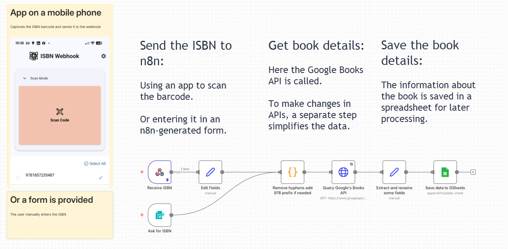
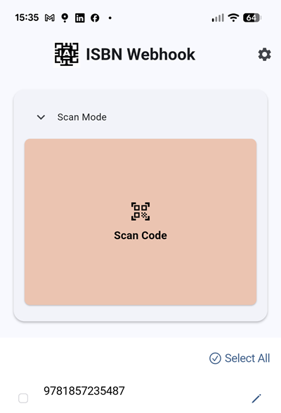
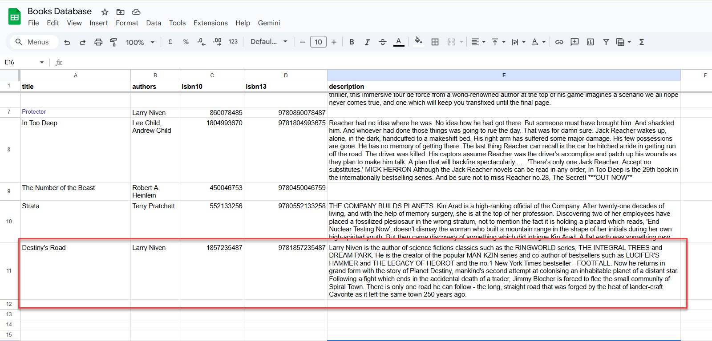

A local entrepreneur friend of mine buys books by the pallet and then resells them - sounds easy, right?

A frustration he has is the time it takes to gather the information about each book (ISBN, author, synopsis etc.).  He needs to get this into his inventory system.

This problem is ripe for an automation which will bring his data entry down to minutes rather than hours per pallet.
<!--more-->

The value in automating the capture of information about the books in the pallet is significant.  Manually processing a pallet could easily take 2, 3 or even 4 hours.  Bringing this time down is key to delivering value.

In a deviation from my usual "systems thinking" approach, I chose to tackle just this one pain-point in isolation and would leave the integration of the captured data into his wider system to a later stage.

This is the first automation that I've written for quite a while that doesn't use AI.  Why, you may ask... Well, there is no real need for AI to deliver the results as simple API calls will do the job at no cost.

## What are the requirements

There are 3 requirements:
1. Stop the manual entry of ISBN 
2. Pull the information on the book from a trusted source
3. Save the information in a database (Google Sheets in this example)

What I'm planning is using a phone to automatically scan the ISBN and send it to the automation platform where it can be used to ask Google Books for the details and then save these in a Google Sheet.

## Mapping the requirements to the high-level flow

Here's a graphical high-level flow:

Implementing this saves my friend 12-20 hours a week.

## Now, for the technical bit

Surprisingly the easiest part of this solution was the automation.  It was up and running in an hour or two.

I initially tried to vibe-code a web-based scanning app to be accessed from a phone but I finally decided that there had to be "an app for that" and sure enough there was.

Here's a screenshot of the app:

You click on the "Scan Code" and the camera displays what it sees.  As soon as it see the barcode it scans it.  This happens so fast I wasn't able to catch the moment when the book's barcode was in view.

When the app has scanned the book's barcode (you can see it at the bottom of the app screenshot above), it is instantly sent to the automation which does its thing and adds the book to the Google Sheets:

## What does it cost?
The n8n server is running on my own homelab, and the book data is retrieved from a free Google API, so other than electricity, there's no direct cost for automation.