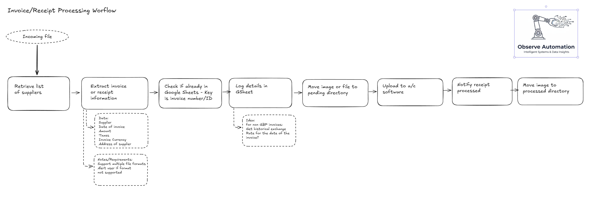

# I hate book-keeping

One of the most tedious aspects of running is a business is entering invoices/receipts/expenses into the accounting system.

It's a slow, manual process that is error-prone.  Automation and AI (for intent and data extraction) is the answer.
<!--more-->

My current process does not send the data all the way to an accounting platform as I haven't set one up yet.  However I will set one up before I finish this article.

As always, I have mapped out the flow in Excalidraw:

The dashed boxes are ideas or notes.

The gist of the flow is:
* Identify newly-arrived documents in the "incoming" directory in GDrive
* Extract the information from the file appropriately (i.e. different processing for PDF and images)
* Check if the file has already been processed - Stop if it has.
* Record the data in a spreadsheet
* Move the file to a "pending" directory
* Create a record in the accounting software
  * This may require creating the customer/supplier if they don't exist
* Notify accounts admins that the file has been processed
* Move image to the "processed" directory

Some challenges we may have to test for:
* Poor quality images that don't OCR well
* Multi-page documents (PDF, Word, etc.)

Last but not least is: Should we have a human in the middle to compare/validate the extraction data in Google?

## Setting-up
I created the Google Drive folders for the various stages of the files.
N8n already has credentials to access Google Drive and Google Sheets.

