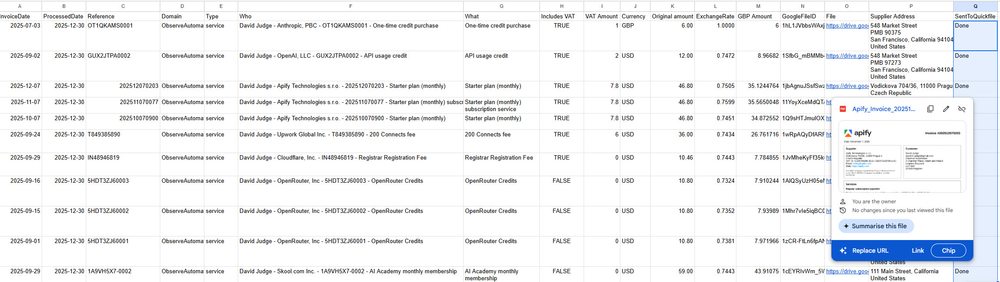
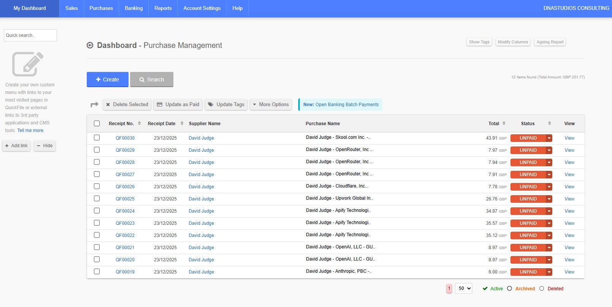
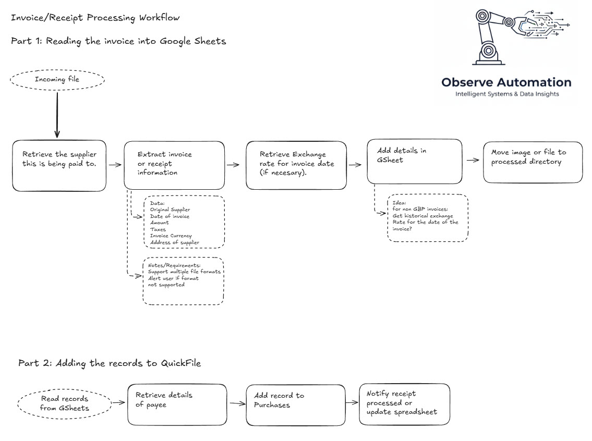
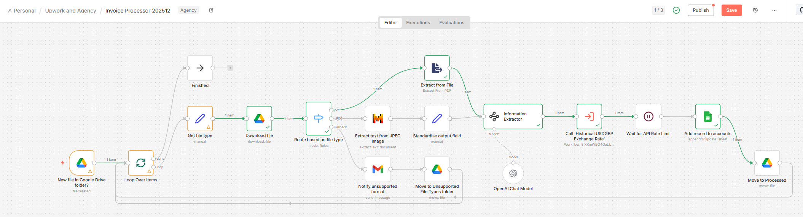
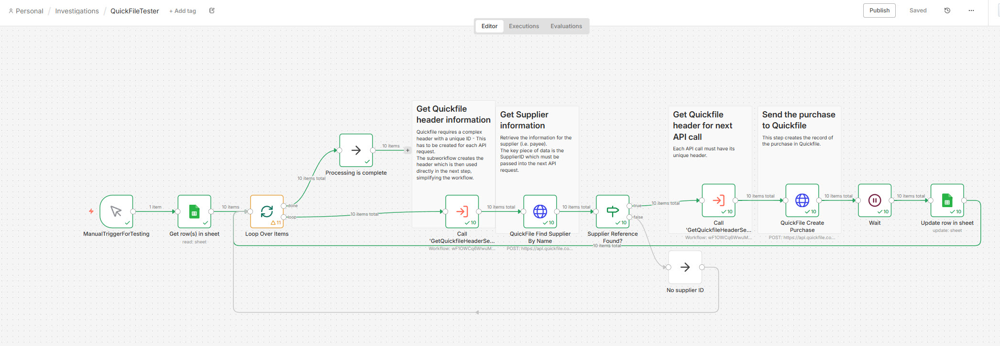

# I hate book-keeping

To me, one of the most tedious aspects of running is a business is entering invoices/receipts/expenses into the accounting system and staying accurate.

It's a slow, time-consuming  manual process that is error-prone.  Automation and AI (for intent and data extraction) can save around 10 minutes per invoice and improve your accuracy.
<!--more-->

As part of my business I have receive a number of invoices or receipts, usually as PDF files, for services or goods that I have paid myself by personal credit card.  The idea is that the business should reimburse these expenses.

The invoices/receipts come by email, usually.  And I need to get these into QuickFile, the accountancy package I'm currently using.

My approach to this breaks the process into 2 main parts:

1. For each invoice, extract the information from the invoice and put it into a spreadsheet
2. Process the spreadsheet and write the record into my accounting system, "QuickFile".

The benefit of splitting this into 2 parts are that you can verify (or correct) the details before they are sent to QuickFile - This is called "human in the middle".

## Preparatory steps
### Accounting!
My mother was a chartered account and I'm afraid to say that none of her knowledge or skills in that area rubbed off onto me.
So I followed a crash course into using QuickFile and, using that base, investigated the APIs that were available in QuickFile.

Sadly, n8n does not intrinsically know QuickFile. Having got to grips with the workings of the QuickFile APIs, I used a plain HTTP node to interact with QuickFile.  Once I'd written the first one, the next ones came very quickly.  I spent more time understanding QuickFile and the knowledge of accounting I needed than integrating with QuickFile.

### Knowing your data
I reviewed the invoices I had and found that most of them were in USD. Examples of these are the subscription to services based in the USA, and AI "Servers" like ChatGP, Anthropic and "OpenRouter".
What I initially thought was going to be an "edge case" (ie. foreign currencies) turned out to be the majority of cases.  This meant that it was not appropriate for someone to manually look up historical exchange rates and enter them into a spreadsheet, but that the automation should do this automatically.

## First Stage: Analysing the invoices
The gist of the flow is:
* Identify newly-arrived documents in the "incoming" directory in GDrive
* Extract the information from the file appropriately (i.e. different processing for PDF and images, etc.)
* Find the exchange rate for that date (if GBP, return 1.00)
* Record (or update) the data in the spreadsheet
* Move the file to a "processed" directory

Should someone want to view the invoice, a link to the invoice is included in the spreadsheet.
Last but not least we have a column "SendToQuickFile" to track which records have been sent to QuickFile.

Here's a screenshot of the spreadsheet showing the invoice (when you hover over the field):

## Second Stage: Recording "purchases" in QuickFile
As always, here a simplified list of the key steps:
* Run on a schedule or on-demand
* Retrieve the information from Google Sheets
* Get Security Header and retrieve the SupplierID from Quickfile
* Get Security Header and add a Purchase to Quickfile
* Wait a couple seconds as the API is rate-limited and we don't want to hit the limits

Here's a screenshot of the purchase records in QuickFile:

## High-level Diagram of the flows
I have mapped out the two flows in Excalidraw:

Currently I don't have many invoices coming in, but this saves me 15-20 minutes per week.

## Screenshots of the flows

### Ingestion of files places in the New Invoices folder

### Creating Purchase records in QuickFile

## What does it cost?
The n8n server is running on my own homelab, so other than electricity, there's no direct cost for automation.

Only image processing uses an AI model.  Currently I'm using Mistral and all my tests have been possible using the free tier so I have has no costs for the extraction of text from the PDFs or images.

The analysis of the invoices is done by an LLM in the cloud: OpenAI gpt-4o-mini (via APIs) which is fast and cheap.  Looking at my API balance I can see that each invoice processed costs less than £0.01 per invoice.