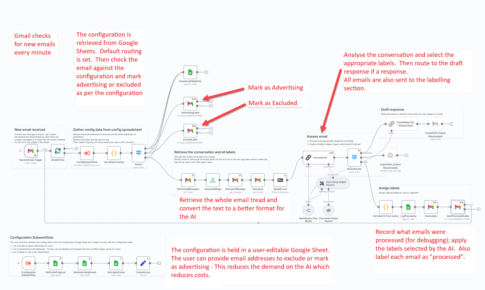

I spend too long every day labelling (or categorising, if you prefer) the many emails I receive.  There has to be a better way!

An automation could automatically read my emails and decide how to label them for me... and more 
<!--more-->

# Auto-labelling emails

As with most projects, this one started with the realisation that I spent too much time sorting  my emails every day and that, once in a while, I would miss an important email due to the large number of emails I get daily.

Before jumping deep into the design, I first listed my "requirements" for an automated solution:
* It must read my new emails (Gmail) quickly and often
* I must be able to somehow ignore emails from a) certain senders and b) advertisers
* I must be able to specify the labels to use
* An AI will read the email and classify it into one of the labels
* The workflow must then apply the label to the email
* The emails to exclude and the labels must be user-configurable

An analysis of the requirements allowed me to confirm that all of the requirements can be achieved by using le low-code n8n and some external integrations/tools (Gmail, GSheets, Anthropic for the AI).

Thus we have this high-level flow:

I wanted the user to be able to update the configuration without having to learn n8n, so I placed the configuration items (emails to exclude, those to mark as advertisers and the labels to use) in a Google Sheet that they can access through their browser.  It's an interface they're used to so they adapted very quickly.

I extended the automation to create draft replies to emails if required (but disabled that).  By placing the replies in the drafts means that nothing leaves the desk without having been viewed/checked by a human!

Here's the final n8n workflow with annotations:

## What does it cost?
The n8n server is running on my own homelab, so other than electrity, there's no direct cost for automation.

The analysis of the job role is done by an LLM in the cloud: Anthropic Clause-3.5-sonnet (via APIs) which is fast but not cheap.  I have tried cheaper models but didn't get the consistency in the labelling I wanted.  Looking at my OpenRouter API balance I can see that each email processed costs between £0.01 and £0.10 (long and complex email conversations).