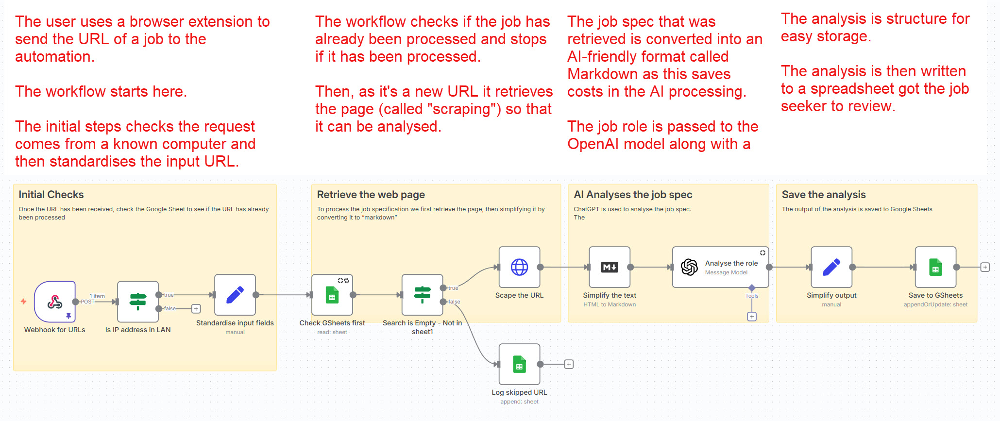

Using my n8n automation skills and my knowledge of GenAI, I built some automations to save time and focus my job search.  The first automation saves me around 2 to 3 hours of reading job roles every day.

Searching for roles can be very time-consuming especially when the job title you're searching for is a common one which applies to a wide variety of domains as is the case for my job title.  
<!--more-->

## Summarising (using GenAI) and keyword search

I use 2 main automations:
* job analysis workflow
* moving applied-to jobs to my tracker

The first automation is triggered when I send a job spec to the automation.  The high-level logic is:

Any roles that are processed by the automation are stored in a Google Sheet i refer to as my "URL" sheet.  Using the URL that triggered the automation as the unique key, the sheet is searched to see if it has already been processed and if it has, the automation stops there to save GenAI costs.

If, however, the url is not already in the spreadsheet, the web page for the role is retrieved, passed through to OpenAI for analysis and the analysis is stored in the same Google Sheet.

The analysis step takes the job spec and produces:
* A precis of the company
* Role location
* Onsite/hybrid/remote
* A summary of the role
* Skills required for the role
* Requirements for the role
* Does the job spec contain the terms:
  * Automation
  * AIOps
  * Observability

To trigger the workflow, as I view the headlines and first paragraph or 2 of a role on LinkedIn (and others), I send the role to the webhook.  I do this using a browser extension which allows me to right-click on a URL and select "send to webhook" in the drop-down.

I skim the "URL" spreadsheet to look for roles that fit my criteria and when I find one, I click on the link to read the full job spec and maybe apply to the position.

This automation has reduced the number of job specifications I need to read from up to 300 per day to a dozen or two.

For the more technically-minded, here's a screenshot of the actual workflow:

## Moving applied-to roles to the tracker spreadsheet
When I have applied for a role, I update my spreadsheet with "applied" in the appropriate column.

The 2nd automation looks in the "URL" spreadsheet for rows where I have entered "applied", copies selected fields of the row to my tracker spreadsheet and then marks them as "tracked" in the original spreadsheet.

The workflow runs on a time trigger every day at 8pm automatically.

Here's the logic:

And here's the actual flow from n8n:
![Move to tracker n8n flow(./images/Jobseeker_Move_to_tracker_Workflow.png)

## What does it cost?
The n8n server is running on my own homelab, so other than electricity, there's no direct cost for automation.

The analysis of the job role is done by an LLM in the cloud: OpenAI's GPT-4O-mini (via APIs) which is fast and relatively cheap for this not-very-taxing task.  Each role processed costs less than £0.01 - I don't know exactly how much but my API credit balance goes down very, very slowly.
