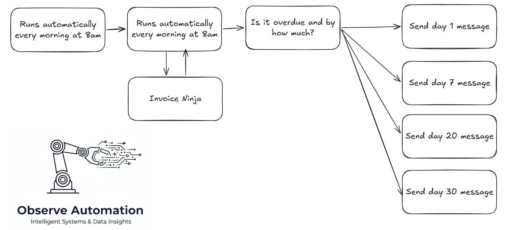
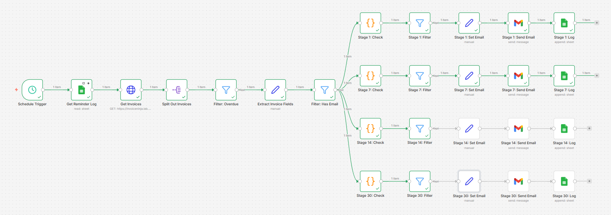
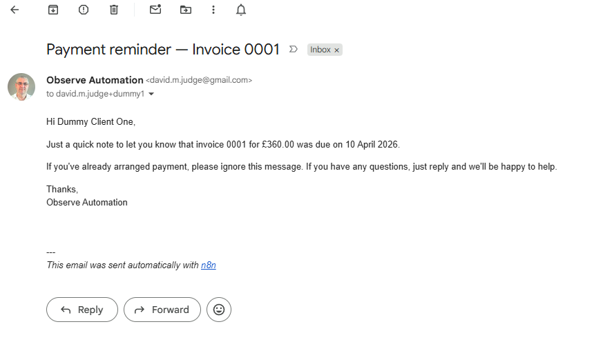

Chasing overdue invoices is one of those jobs that always feels urgent but never quite makes it to the top of the to-do list. This automation does it for you, every morning, without you having to think about it.

<!--more-->

Every small business owner knows the discomfort of having to chase a client for money. You don't want to seem pushy, you're not sure how long to leave it, and when you do finally get round to it you have to figure out what stage you're at with each invoice. It takes time, it's awkward, and it's entirely avoidable.

Before building the solution I listed what it needed to do:

* Check for overdue invoices automatically every morning
* Send a different reminder depending on how long the invoice has been outstanding
* Never send the same reminder twice, even if the workflow runs daily
* Log every reminder sent, so there's a clear record
* Be easy to hand over to a client — editable email templates, no coding required

Here's the high-level flow:

 

The workflow runs at 8am every day. It fetches all sent and partially-paid invoices from Invoice Ninja, filters to those past their due date, and works out how many days overdue each one is.

Reminders escalate automatically based on how long the invoice has been outstanding: a friendly nudge on day 1, a polite follow-up at day 7, a direct request at day 14, and a final notice at day 30. Each reminder is sent once. Before sending, the workflow checks a Google Sheet log to confirm that particular stage hasn't already gone out for that invoice — so clients never receive a duplicate regardless of when the workflow runs.

Once an email is sent, the log is updated with the invoice details, the reminder stage, and the timestamp.

For the more technically-minded, here's the workflow in n8n:

One of my priorities with this build was making it easy to hand over to a client. None of the logic lives in code nodes — the escalation thresholds and email wording are all in plain editable fields that anyone can open and update without touching any code. The four reminder stages are separate branches in the workflow, so it's clear at a glance which stage is which and what each one does.

To change the wording of a reminder, the client simply opens the relevant stage in n8n and edits the subject line or body text directly — it looks and feels like editing a template in any email tool they've used before. No programming knowledge required.

Changing the escalation timing is just as straightforward. Each stage has a single number that controls how many days overdue an invoice needs to be before that reminder fires. A client who wants to give customers a bit more grace before the first nudge just changes "1" to "3". One field, one change, done.

Here's an example of one of the reminder emails as it arrives in the client's inbox:

## What does it cost?

The n8n server is running on my own homelab, so other than electricity, there's no direct cost for the automation itself.

Invoice Ninja is self-hosted on the same infrastructure — it's a fully-featured open source invoicing platform, free to self-host, and a credible alternative to Xero or QuickBooks for small businesses.

The only external service used is Gmail for sending emails, which has no per-send cost at the volumes a small business would generate.
