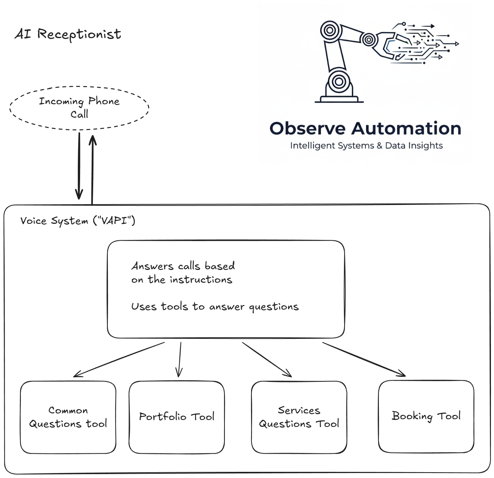
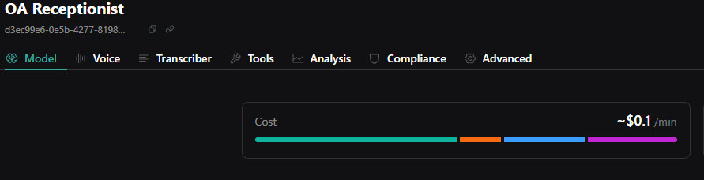

Can't get away from something when a call comes through?  Are your risking losing customers?

Maybe all the caller wanted was your opening hours or maybe just to book an appointment.

<!--more-->

Today, being tied to answering every call is no longer necessary.  An AI Receptionist can answer calls and handle queries based on your company's information, book appointments and, of course, hand-off the call to a real person.
  
## This time the customer is me - my [ObserveAutomation](https://www.observeautomation.com) business

### What should my receptionist do?

I need the AI to answer questions with information from my company's frequently asked questions.

This should include information on the services I offer.

Should they ask about my portfolio, it should recommend my [company's website](https://www.observeautomation.com) as the place to see my portfolio.

It should let the user leave me a message and send it to me (GMail or WhatsApp).

Last but not least, allow them to book a meeting with me.

And it should do this while sounding a bit like me - I mean my way of talking (tone, etc.).  While it is possible to train an AI to actually sound like me, that's not what I'm trying to do here and I think it might confuse customers.  

At a very high level, this is what it looks like:

The core of the system handling the call is called VAPI and it is what talks to the customer.  It has some information but mostly has instructions on how to answer in generic terms (for example: don't ask the same question twice).

VAPI is configured with some "tools" that it may call upon.  Some of the tools are intrinsic to VAPI, and some are external.  In this project, these external tools are configured in the automation platform ("n8n") and may be anything from a simple workflow to complex AI flows.

We have provided a number of such tools for VAPI:

1. Answers questions based on information in our FAQ
2. Answers questions on ObserveAutomation's portfolio
3. Answers questions on what services ObserveAutomation provides
4. Finds availability for appointments and books the appointments
5. Transfer the call

 The first 3 are very similar: Instructions on how to answer questions and information (i.e. the FAQ, Services description, Portfolio description) are provided to an AI along with the caller's question.  The reply from the AI/workflow is spoken back to the caller.

 The 4th one will allow the caller to ask for an appointment on a date and time an,d if it's not available, provide availability information.

## What does it cost?
There are three areas with costs:
### Twilio
Twilio charges for the provision of its service - for a UK phone number, it's around £0.85 per phone number per month.

### VAPI
VAPIs costs are built up in multiple parts:
1. VAPI itself $0.05/min
2. Transcriber $0.01/min
3. AI Model for VAPI $0.02/min
4. Voice API $0.022/min

In the VAPI console you can see the cost of each assistant and when you hover over the graph the individual costs appears.

One thing to note is that the VAPI costs can vary depending on your choices.  If you use a more costly AI for VAPI to respond to callers and the instructions it has, your costs will go up.  Also we chose a VAPI-provided voice but there are other providers... Should we have chosen Eleven Labs as our voice provider, the voice API costs would almost certainly have increased.

### The n8n server
The n8n server is running on my own homelab, so other than electricity, there's no direct cost for automation.  However, for the AI used by n8n...

### AI Costs
Deciding what information to give the caller is done by AI.  Mostly, in this case, by Gemini.
I will monitor the costs over time and update this article.  But in a few days of testing, my billing page shows a total of $0.003 (i.e. a third of a pence).

